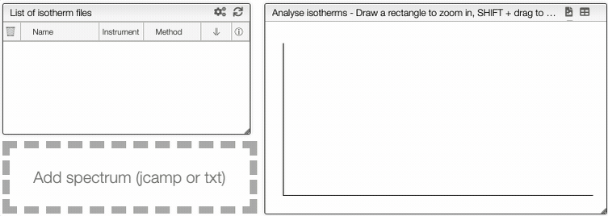

import CustomColumn from "../../includes/custumColumns/README.md";
import Preprocessing from "../../includes/preprocessing/README.md";
import Correlation from "../../includes/correlation/README.md";
import Colors from "../../30_structural_analysis/includes/showhide/README.md";
import Manual from "../../30_structural_analysis/includes/peakpick/README.md";
import Auto from "../../30_structural_analysis/includes/autopick/README.md";

# Raman Spectroscopy

## Theoretical background

**[Raman](https://en.wikipedia.org/wiki/Raman_spectroscopy)** spectroscopy is an analytical technique mainly used to determine the vibrational modes of molecules. The working principle of such technique relies on a monochromatic light (e.g. visible, near infrared or near ultraviolet) which is shined on a sample and excites the molecule to a virtual energy state for a short time. The emitted photons can present either higher or lower energy than the incident photon and this change in the kinetic energy is known as **[inelastic scattering](https://en.wikipedia.org/wiki/Inelastic_scattering)** which is specific to a molecule's chemical bond. Raman spectroscopy is often used in chemistry in order to indentify molecules and assessing the chemical bonds present in the molecule.

The induced dipole moment of a molecule due to an external electric field can be written as,

$$
\mathbf{\mu}_\text{induced} = \overleftrightarrow \alpha \mathbf{E}
$$

Where $\overleftrightarrow \alpha$ is the polarizability tensor and $\mathbf{E}$ is the external electric field. The polarizability tensor can be represent by a 2x2 matrix as following

$$
\overleftrightarrow \alpha = 
\begin{bmatrix}
\alpha_{xx} & \alpha_{xy} & \alpha_{xz}\\
\alpha_{yx} & \alpha_{yy} & \alpha_{yz}\\
\alpha_{zx} & \alpha_{zy} & \alpha_{zz}
\end{bmatrix}
$$

### Selection rules

If the applied electric field is constant, the intensity of a transition is proportional the the integral:

$$
\int \psi_{2 \text{vib}}^* \hat{\mu} \psi_{1 \text{vib}} \mathrm{d} Q \propto \int \psi_{2 \text{vib}}^* \hat{\alpha}_{ij} \psi_{1 \text{vib}} \mathrm{d} Q
$$

Where $\psi_{2 \text{vib}}$ is the upper level vibrational wavefunction and $\psi_{1 \text{vib}}$ the lower one.

These kind of integrals can be estimated in two ways: either by group theory or by an approximation.

Using group theory, the integral is non zero if and only if the direct product of the integrand contains the totally symmetric representation, meaning that,

$$
\Gamma (\psi_{2 \text{vib}}) \otimes \Gamma (\hat{\alpha}_{ij}) \otimes \Gamma (\psi_{2 \text{vib}}) \subset \Gamma_{\text{tot sym}}
$$

The other method consists of expanding one component of the polarizability tensor as a power seres in the normal coordinates $Q_k$:

$$
\alpha_{ij} = (\alpha_{ij})_0 + \sum_k \left(\frac{\partial \alpha_{ij} }{\partial Q_k} \right)_0 Q_k + \sum_k \sum_j \left(\frac{\partial^2 \alpha_{ij} }{\partial Q_k \partial Q_j} \right)_0 Q_k Q_j + ...
$$

If we take only the first two terms and we neglect higher order terms, this lead to the integral, for a single particle,

$$
\int \psi_{2 \text{vib}}^* \hat{\alpha}_{ij} \psi_{1 \text{vib}} \mathrm{d} Q_k = (\alpha_{ij})_0 \int  \psi_{2 \text{vib}}^* \psi_{1 \text{vib}} \mathrm{d} Q_k + \left(\frac{\partial \alpha_{ij} }{\partial Q_k} \right)_0 \int \psi_{2 \text{vib}}^* Q_k \psi_{1 \text{vib}} \mathrm{d} Q_k
$$

Therefore, the Raman vibrational transition is allowed for a change in vibrational quantum number of $\pm 1$ ($\Delta v = \pm 1$).

# Raman spectra

## Upload a file
You can upload a `JCAMP` or a `txt` file in the following way:

## Preprocessing

At the right of the graph, you can apply filters on the curve using the preprocessing module.

<Preprocessing/>

## Peak picking

Bellow the preprocessing module, it is possible to **manually** pick peaks on a spectrum by holding down the `ALT` key, and then left-clicking on the peaks of interest. Or, you can select the interval that you want and click on `Auto peak picking` to choose the picks of interest **automatically**.

<Manual/>

<Auto/>

:::caution
The auto peak picking is processed before the application of filters. If the spectra has too much noise, it is better to use manual peak picking
:::

## Export

You can export the spectrum as a `svg` or a `pdf` file. You can also export in two different formats the results of the peak picking.

## Compare spectra

You can compare multiple Raman spectra by first opening up a spectrum, and then clicking `Compare` on top of graph.

The spectra will then be both displayed on top of each other. You can also freely **hide selected graphs and change the color** by clicking the color bar.

<Colors/>

## Surface analysis

If the graph contains the data, you can click on `Surface analysis`. In the **Raman image**, you can go on each pixel with the cursor and you will see the corresponding spectrum on the right. If you click on one pixel and put the cursor on another, you will be able to compare the two spectrum, the one that you click will appear in red and the curve of the pixel under the cursor will be blue.

On the bottom, you have the preprocessing command to apply filters on all the spectra. Spectra are plotted all in the same graph, at the bottom right. With the **Image color** module, you can rescale the pixels to a specific color proportionally to its intensity on its spectrum. 

In the graph containing all the spectra, you can choose to show the original data or the normalized spectra. If the spectra are normalized, you can add `box plot` to all curve so that we see the median of the distributions and the trends. 

Additionally, you can activate the correlation. Correlation is explained bellow. Here, you can either select all the spectra to be correlated or none of them.

<Correlation/>

<CustomColumn/>

### References

1. M. Drabbels, Lectures Notes "Spectroscopy", EPFL, 2022.
