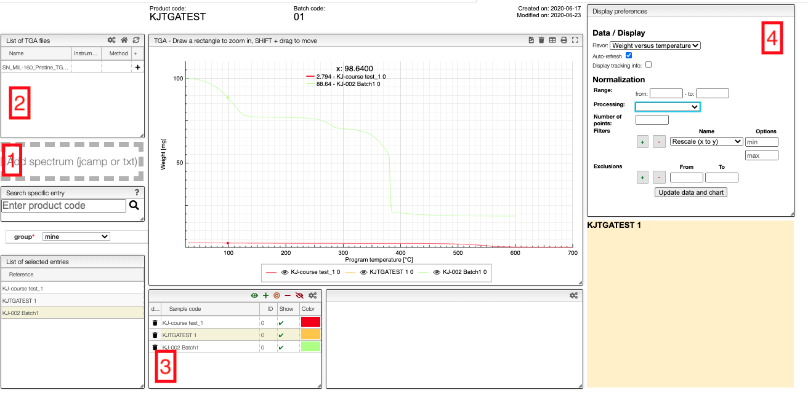

# Thermogravimetric analysis

[Thermogravimetric analysis (TGA)](ttps://en.wikipedia.org/wiki/Thermogravimetric_analysis) is a technique often used for the assessment of physical phenomena of a sample (e.g. phase transitions, absorption, adsorption and desorption) as well as chemical phenomena (e.g. chemisorption, thermal stability, among others). During the measurement, the temperature is gradually increased and the sample mass is continuously recorded over time. The data is collected and provided as a graph, in which the mass or percentage of initial mass is plotted as function of time or the furnace temperature. 
A typical thermogravimetric instrument possesses a precision balance with a sample holder located inside the furnace, whose temperature can be regulated with a controller. The measurement can occur under several different conditions, such as: ambient air, inert atmosphere, oxidising/reducing gases, corrosive gases, carburising gases as well as vacuum or high pressure or constant or controlled pressure.

This module allows visualizing and processing TGA curves. You can upload `txt` files and `jcamp` files.

## Upload

Files can be uploaded either by drag-and-drop to the field on the left-hand-side (1 in the image) or automatically from the instrument. The files will appear in field 2. Note that you can only upload files to samples to which you have write access.

## Visualization

To add patterns to the visualizer, click on the `+` in field 1. The sample will then appear in field 3 from which you can control the visualization settings.

If you click on the color in a row, you can select any color you which for the line, and you can use the control buttons in the top right corner of field 3 to control which figures you show in a spectrum.

In the chart you can draw a rectangle to zoom and double click to reset. You can move the graphs by pressing `SHIFT ⇧` while dragging them.

Currently, we can display weight vs. temperature and weight vs. time. A percentage-weight-loss view is currently being implemented.

## Processing

Field 4 gives you some basic processing tools.

- Units: select if you plot `Weight [mg] versus temperature [°C]` or `Weight [mg] versus time [s]`
- Display tracking info: display information about the position of the mouse

### Normalization

- Range: select the min / max X value to display
- Processing: display either the normal spectrum, first derivative or second derivative
- Number of points: reduce the number of points in the spectra. This is a nice feature
  that allows to align the spectra on the 'x' axis but can only be used if the spectrum
  is monotone!
- Filters: various filter allowing to process the data. By default, the `Divide by max Y` filter
  is applied and allows getting as max Y value 1.
- Exclusions: define zone that should be ignored during processing.
