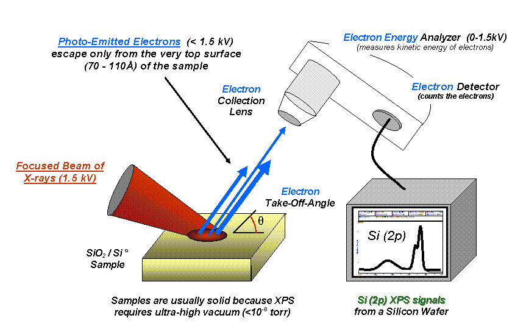
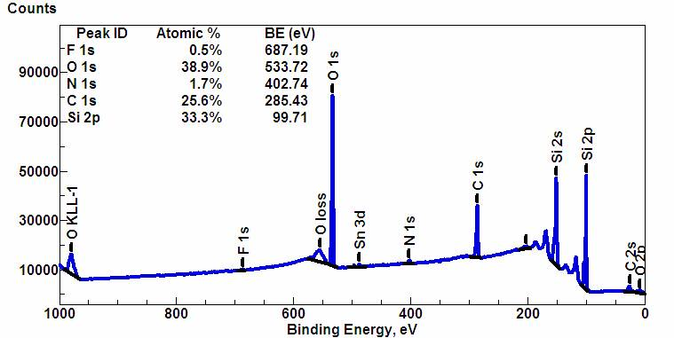

import CustomColumn from "../../includes/custumColumns/README.md";

# X-ray photoelectron spectroscopy (XPS)

[XPS](https://en.wikipedia.org/wiki/X-ray_photoelectron_spectroscopy) is a surface-sensitive spectroscopic technique which allows for the assessment of the elemental composition of a material's surface as well as the elements chemical state. Also the electronic structure and density of the electronic states of the material can be determined. XPS is often used for the study of chemical reactions or the assessment of novel structures as it shows which elements are present in a particular material and which elements they are bonded.

XPS is a technique based on the photoelectric effect, where an X-ray beam hits the material and electrons escape from the surface. These emitted photoelectrons reach then an electron energy analyser, which measures the kinetic energy, as well as a detector that counts the number of electrons.

The data obtained corresponds to a spectrum in which the number of electrons are plotted as a function of the specific binding energy [eV] at which they were detected. Each element of the periodic table gives rise to a specific set of XPS peaks which also determines the electronic configuration (e.g. 1s, 2s, 2p, etc.). Similarly, the number of electrons corresponding to each peak is associated to the amount of that particular element within the XPS analysed sample.

# Analyze Window

In this view, it is possible to drag and drop XPS files (vms files). Every sample usually has a list of spectra associated with it, typically including a wide scan and several individual orbitals. Each spectrum can be visualized by clicking on the name of the file in the list of XPS files.

# Wide scan

By zooming in on individual peaks in the wide scan, a list of possible orbitals and their corresponding binding energies are filtered in the "List of reference values"

# Compare Window

Orbital energies of different samples can be compared in the "Compare" view. In the "List of selected entries", a sample can be searched for by entering the product/sample code in the search box. By clicking on a sample, a list of spectra for different orbital energies appears in the "List of XPS files" below. By clicking on one of these files, the spectra are displayed and the file is listed in the "List of displayed spectra".
Note, that it is advised to only compare charge corrected samples in this way since otherwise, chemical shifts can not be compared.

<CustomColumn/>
