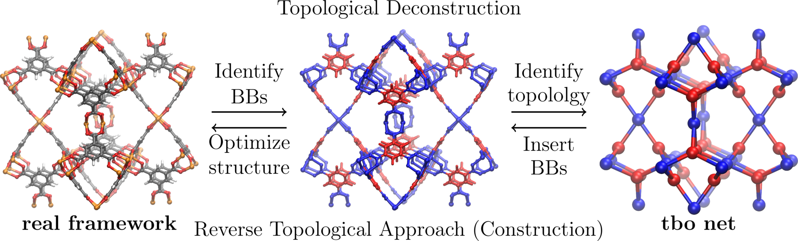

# Crystal structure upload and processing

This view allows you to upload and visualize `CIF` and `PDB` files.

Distance between atoms can be measured and information about the cell will be displayed if available.

## Measure distances, angles and dihedral angles

Distance between atoms can be measured and information about the cell will be displayed if available.

Using JSmol you can easily measure properties. Some shortcuts are outlined below. To change visualization style (e.g. spacefill, wireframe etc.), right-click in the JSmol viewer and select the 'Style' tab. To delete a measurement right-click in the JSmol viewer, scroll to the 'Measurements' tab and click 'Delete measurement'. Further visualization and measurement tools (e.g. surfaces, atom labels etc.) can be found similarly.

### Distance

- double click on the first atom
- double click on the second atom

### Angle

- double click on the first atom
- single click on the second atom
- double click on the third atom

### Dihedral angle

- double click on the first atom
- single click on the second atom
- single click on the third atom
- double click on the forth atom
- 

## Net topology for periodic materials

The topology of crystal structures can be described in terms of a net.
In case of metal-organic frameworks, one instead often uses the nodes as the vertices (red in figure below) and the linkers as the edges (blue in figure below) of the net.

We use a custom webservice to compute the [RCSR code](https://rcsr.anu.edu.au/) using a simple metal-oxo clustering approach.

The computed topology code will be stored in the database and shows up in the sample table on the top left.

## Pore properties

For porous materials we use an overlapping sphere approximation to calculate pore properties. You can find more information about these properties in [Ongari et al.](https://pubs.acs.org/doi/10.1021/acs.langmuir.7b01682) and [Trepte and Schwalbe](https://chemrxiv.org/engage/api-gateway/chemrxiv/assets/orp/resource/item/60c750f39abda213aaf8db07/original/systematic-analysis-of-porosities-in-metal-organic-frameworks.pdf).

## Integration with molecular and atomistic simulations

Often, it is useful to compare experimental results with simulations.
Using the ELN-AiiDAlab integration you can perform this yourself for simple simulations!

[AiiDAlab](https://www.materialscloud.org/work/aiidalab) is a platform that provides a frontend to complex simulation workflows orchestrated using the [AiiDA infrastructure](https://www.aiida.net/).
The starting point for all simulation is an input structure. If you have selected a structure in this view, you can click the "submit" button to submit the crystal structure with all relevant metadata to the AiiDAlab. There you will be guided through the steps of setting up a molecular simulation, e.g., to simulate a gas adsorption isotherm.
After the simulation, you can export the results (e.g., DFT optimized crystal structure or simulated isotherm) to the ELN and overlay them with the experimental data.
