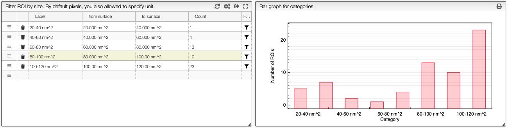
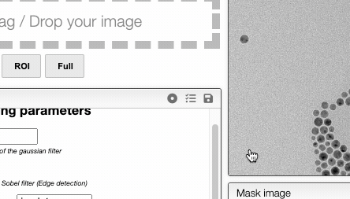
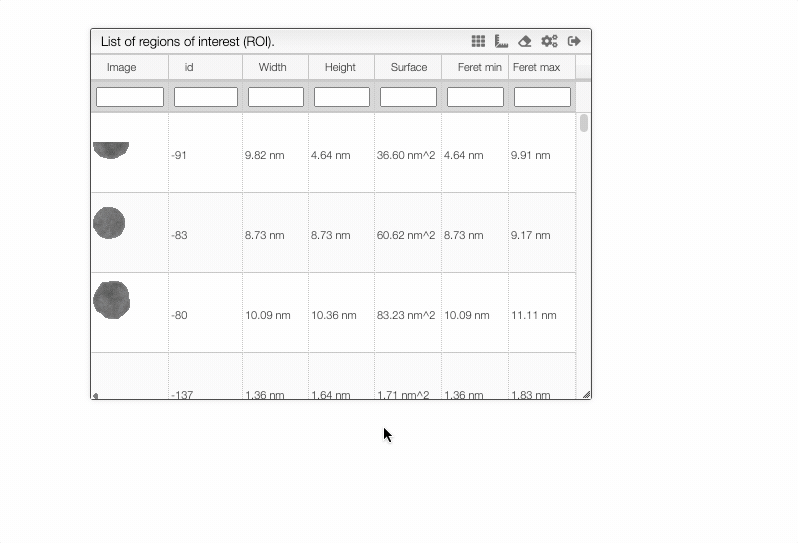

import { FaCogs } from 'react-icons/fa';
import Annotations from './includes/annotations/README.md';
import Rois from './includes/rois/README.md';
import PixelSize from './includes/definePixelSize/README.md'; 
import SelectRois from './includes/selectROIs/README.md';
import Categories from './includes/categories/README.md';

# Image analysis

This view allows to annotate images as well as identify Region of Interests on grey scale images.

If the source if a color image a first step will be to convert it to a grey scale image using one of the provided algorithms.

If you don't know which algorithm to use you may `Explore greys`. The system will reduce the size of the image
and try all the available algorithms. You should then select the one that yields to the highest contrast.

## Example of Analysis of SEM / TEM images

The image coming out of the SEM microscope is expected to be in TIFF 16 bits. Apparently some software destroy the image to 8 bits when adding the scale.

There are 3 steps in order to process your image:

1. The first step is to apply a gaussian filter to the image \(blurring\). Values of 4 to 8 seem reasonable.
2. The second step will generate a mask. The white pixels are the 'positive' area while the black one negative. You may either select one of the provided algorithms or use the 'threshold' algorithm. In this later case the 'Threshold for mask' value will be taken into account. It should be a value between 0 and 100 \(percent of white\).
3. Finally the third step is to create the Regions Of Interest \(ROI\). It is possible to define the minimal surface, positive / negative as well as the 'Scale' factor that will be applied to the ROI.

### Creating the mask

In order to create regions of interest (ROIs) it is required to create a mask (a black and white image). Creation of the mask is based on the threshold that define the level of grey intensity that separates the white pixels from the black pixels.

This threshold can be determined automatically using one of the provided algorithm or it can be entered manually as a value between 0 and 100% if the algorithm stays unspecified.

In order to quickly evaluate which algorithms or threshold should be used you can click on `Explore masks` and select the more suitable threshold. This function requires that blurring has been applied before.

### Creating and filtering ROIs

Once the threshold has been determined it is time to create the ROIs. 4 algorithms are available:

- Positive: the ROIs are white
- Negative: the ROIs are black
- Watershed: there are some ROIs that overlaps and we need to separate them. The ROIs are white
- Inverted watershed: same as Watershed but the ROIs are black

There is also the possibility to scale the obtained ROIs. This may be practical in order to get average color of a spot.

### Painting the final image

The result of analysis can be graphically displayed on the original image and many options allow defining what should be displayed.

### ROI Analysis

By clicking on the ‘ROI Analysis’ button you will have access to a table containing various parameters of the different ROIs.

Among other you will have access to the MBR \([Minimal bounding rectangle](https://en.wikipedia.org/wiki/Minimum_bounding_rectangle)\). The ratio between the surface of the MBR and the surface of the ROI \(Region Of Interest\) is what we call the ‘filling factor’, 100% means a cube, a sphere should be π/4 \(78.5%\)

### ROI Categories

If you click on `ROI Categories` you will be able to define categories based on characteristics of the ROIs.
This panel will also display an histogram that contains the different categories.

<Categories/>

### Save / Load preferences

From the 3 icons present on the top of the preferences window it is possible to:

- load the default preferences
- load saved preferences
- save the current preferences

This allows to store templates of preferences depending the kind of images you are processing.

### Exporting data and table customization

It is possible to define the column you want to display / export as well as the format

Columns can be customized by clicking on the <FaCogs/> icon that is present in the top of the table. Those preferences are used to customize not only which information is displayed but also how it will be exported. This means that if the units are displayed they will also be exported.

If you which to hide the units for importation there is the possibility to specifiy `numeral: '0.00', hideUnit: true`.

### Other tips

<Annotations/>

<Rois/>

<PixelSize/>

<SelectRois/>
