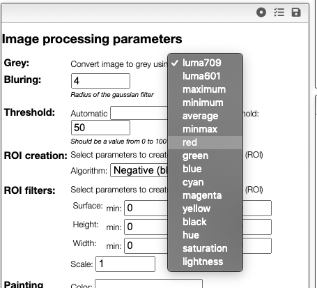
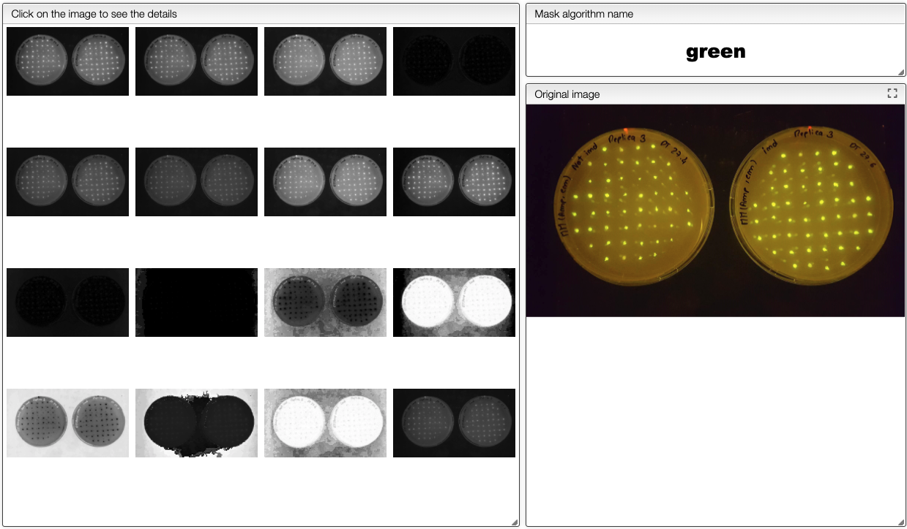
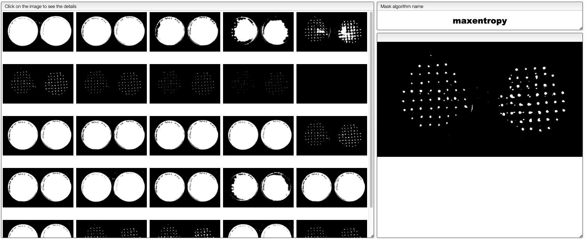
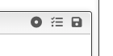

# Image analysis

This view allows to annotate images as well as identify Region of Interests on grey scale images.

If the source if a color image a first step will be to convert it to a grey scale image using one of the provided algorithms.

If you don't know which algorithm to use you may `Explore greys`. The system will reduce the size of the image
and try all the available algorithms. You should then select the one that yields to the highest contrast.

## Example of Analysis of SEM / TEM images

The image coming out of the SEM microscope is expected to be in TIFF 16 bits. Apparently some software destroy the image to 8 bits when adding the scale.

There are 3 steps in order to process your image:

1. The first step is to apply a gaussian filter to the image \(blurring\). Values of 4 to 8 seem reasonable.
2. The second step will generate a mask. The white pixels are the 'positive' area while the black one negative. You may either select one of the provided algorithms or use the 'threshold' algorithm. In this later case the 'Threshold for mask' value will be taken into account. It should be a value between 0 and 100 \(percent of white\).
3. Finally the third step is to create the Regions Of Interest \(ROI\). It is possible to define the minimal surface, positive / negative as well as the 'Scale' factor that will be applied to the ROI.

### Creating the mask

In order to create regions of interest (ROIs) it is required to create a mask (a black and white image). Creation of the mask is based on the threshold that define the level of grey intensity that separates the white pixels from the black pixels.

This threshold can be determined automatically using one of the provided algorithm or it can be entered manually as a value between 0 and 100% if the algorithm stays unspecified.

In order to quickly evaluate which algorithms or threshold should be used you can click on `Explore masks` and select the more suitable threshold. This function requires that blurring has been applied before.

### Creating and filtering ROIs

Once the threshold has been determined it is time to create the ROIs. 4 algorithms are available:

- Positive: the ROIs are white
- Negative: the ROIs are black
- Watershed: there are some ROIs that overlaps and we need to separate them. The ROIs are white
- Inverted watershed: same as Watershed but the ROIs are black

There is also the possibility to scale the obtained ROIs. This may be practical in order to get average color of a spot.

### Painting the final image

The result of analysis can be graphically displayed on the original image and many options allow to define what should be displayed.

### Categories

By clicking on the ‘categories’ button you will be able to

The system will also calculate the MBR \([Minimal bounding Rectange](https://en.wikipedia.org/wiki/Minimum_bounding_rectangle)\). The ratio between the surface of the MBR and the surface of the ROI \(Region Of Interest\) is what we call the ‘filling factor’, 100% means a cube, a sphere should be π/4 \(78.5%\)

### Save / Load preferences

From the 3 icons present on the top of the preferences window it is possible to:

- load the default preferences
- load saved preferences
- save the current preferences

:::tip Annotations
It is possible to annotate and measure images with lines and polygons.
Find more info [here](includes/annotations/README.md).
:::

:::tip Regions of interest (ROIs)
Many parameters are calculated for regions of interest.
Find more info [here](includes/rois/README.md).
:::

:::tip Stats and categories
The different ROIs can be grouped and counted.
Find more info [here](includes/categories/README.md).
:::

:::tip Define pixel size
Pixel size can be defined manually or automatically.
Find more info [here](includes/definePixelSize/README.md).
:::

:::tip Save and load preferences
It is possible to save and load preferences in order to reapply always the same processing.
Find more info [here](includes/saveLoadPrefs/README.md).
:::

:::tip Select ROIs
Regions of interest may be selected before exportation.
Find more info [here](includes/selectROIs/README.md).
:::
