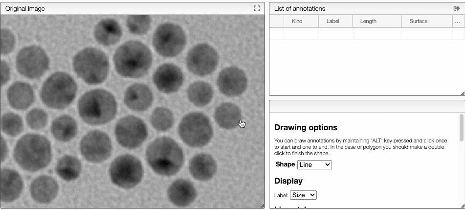
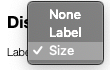

## Define pixel size

The image analysis tool allows to draw lines and polygons directly on the image.

All the annotations will be saved with the sample back in the database.

Using annotations it is possible to determine the surface or length of some specific area
of the image.

### Drawing annotations

In order to draw annotations:

- for a `line`: click once for the beginning of the line and another time for the end of the line
- for a `polygon`: click once fpr aéé the corners of the polygon, click twice for the end of the shape.

### Display labels

It is possible to display labels either as a custom text or as the value of the shape (length or surface.

### Changing style

Style of the label and the shape can be customized according to the preferences. Opacity is a value between 0 and 1. 0 meaning fully transparent and 1 fully opaque.
