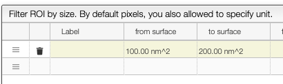
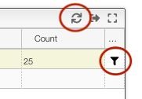

:::tip Categories

    

    How to create ROI categories.
    

    

# Create ROI categories

Region Of Interests (ROIs) can be grouped and counted in categories by clicking on the button `ROI categories`.

The criteria related to surface or length it is either possible to specify the minimal / maximal number
of pixels or to specify the size with the unit.

You may define an unlimited number of categories based on the available criteria. There is always a from / to range for
each of the criteria.

## Checking a specific category

It is possible to display the ROIs belonging to a specific category by clicking on the `filter` icon. To come back to the full list of ROIs
you should click on the `sync` icon.

:::