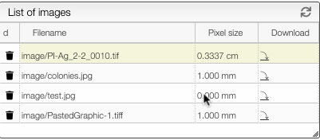
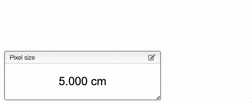
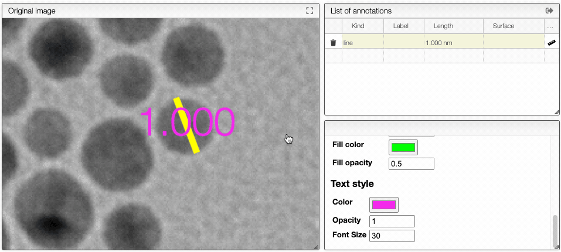

# Define pixel size

In order to know the size of ROIs or annotations it is important to define the pixel size.

In some case this information can be extracted from the meta information of the image. It can
also be defined by the user using one of the 3 following approaches:

## From the list of images

In the list of images you can directly double click on the pixel size and enter a value with the
corresponding unit.

## From the annotations tab

In the annotation tab you can click on the edit button on the top of the `Pixel size` box.

You can also draw a line and specify the length of the line. This will calculate automatically
the size of a pixel.

