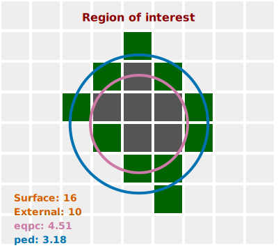
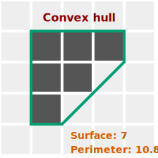

:::tip REGIONS OF INTEREST (ROIS)

    

    Many parameters are calculated for regions of interest.
    

    

# Information about ROIs

Many parameters characterizing ROIs are automatically calculated.

## ROI

Region Of Interest (ROI) posses various characteristics. Among them:

- Surface: the number of pixels in the ROI
- External: the number of pixels that touch at least one other external pixel
- Perimeter: ROI perimeter using cutting edge algorithm (see illustration)
- Diameter of a circle of equal projection area (DEQPC):
  
- Diameter of a circle of equal perimeter (DPED):
  

Calculation of perimeter of pixel based images is not a trivial topic. This has been reviewed in the [literature](http://urn.nb.no/URN:NBN:no-13191).

In this tool we use the following approach:

- We count all the pixel sides that are outside the ROI (each side counts as 1)
- If a pixel has 2 external sides, we remove from the sum (2 - √2) = ~0.59
- If a pixel has 3 external sides, we remove from the sum 2 \* (2 - √2) = ~ 1.17

This means that for each border pixel the contribution to the perimeter is:

- pixels with one external side: 1
- pixels with two external sides: ~1.41
- pixels with three external sides: ~1.83

Practically the shape of the perimeter is represented in the following image:

## Minimum bounding rectangle (MBR)

An information that allows to determine the shape of a ROI is the `Minimum Bounding Rectange`(MBR) that represents the smallest rectangle that surround the ROI.

The MBR is characterized by:

- width: length of the longest side of the rectangle
- height: length of the smallest side of the rectangle
- perimeter: perimeter of the rectangle
- surface: surface of the rectangle

## Convex Hull (CH)

The convex hull may be visualized as the shape enclosed by a rubber band stretched around the ROI. It is useful to estimate the compactness of the ROI.

Two parameters are available for the convex hull:

- surface
- perimeter

## Feret diameters

The feret diameters of a ROI can be calculated using a virtual caliper. 2 diameters are calculated:

- min: the minimal size of the ROI that could be measured using a caliper
- max: the maximal size of the ROI that could be measured by a caliper
- ψA (Aspect ratio): ratio of the minimum to the maximum Feret diameter (0 < ψA ≤ 1), an indication of the elongation of the particle

## Other parameters

### Sphericity

The sphericity is the ratio of the perimeter of the equivalent circle, PPED, to the real perimeter, Preal.
A perfect sphere as a sphericity of 1. The idea is that irregular shape causes an increase in the perimeter and therefore this ratio has a lower value. Knowing that the smallest possible perimeter for a given projection area is a circle, 0 < S ≤ 1.

Please note that the evaluation of perimeter is a complex topic and check above the approach that is used in this application. It
is not impossible that the sphericity is slightly higher than 1.

### Convexity

The convexity ($\psi_C$) describes the compactness of a particle. The convexity is the ratio of the projection area itself and the area of the convex hull. The maximum theoretical convexity is 1, if there are no concave regions. Due to the pixelation of images, all particles seem to have small concave regions, corresponding to the tiny steps with every pixel in the perimeter line. Therefore, the maximum convexity calculated in reality is mostly limited to 0.99.

### Roundness

:::