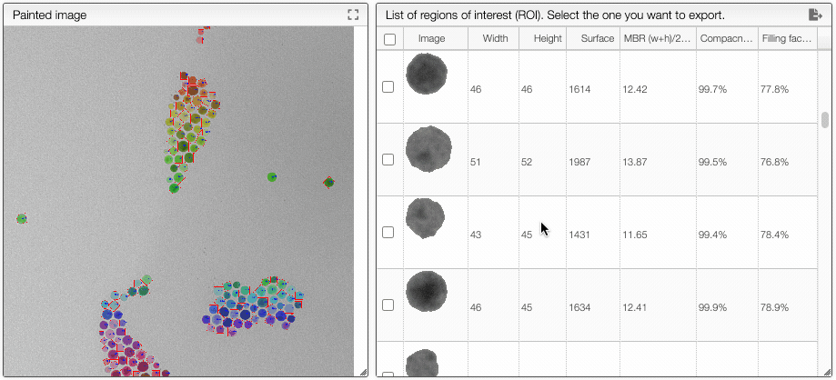

## Select ROIs for exportation

It is possible to select some region of interests (ROIs) to export either from the `ROIs` table by clicking the checkbox in the first column or by clicking on the ROI directly in the image.

