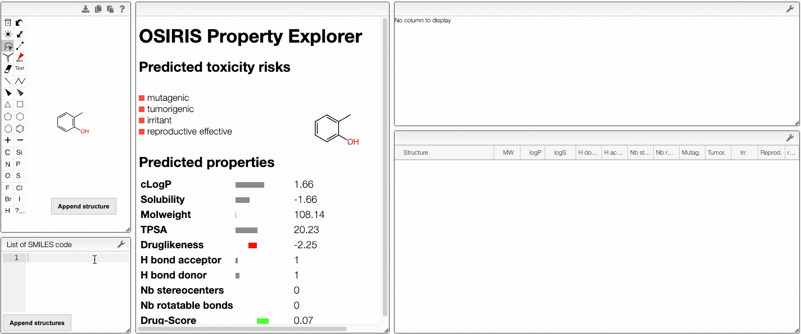
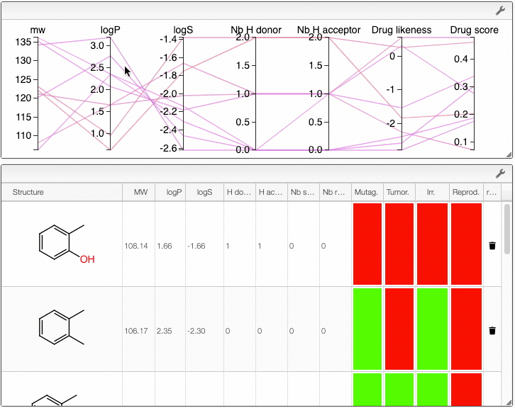

# Property explorer

## Properties of a molecule

In this view, you would use OSIRIS Property Explorer provided by Thomas Sander to get access to predicted properties of molecules. By drawing a molecule, OSIRIS Property Explorer calculates on-the-fly various drug-relevant properties such as the octanol-water partition coefficient (log P) or the druglikeness of the compound. The structure edition is powered by [OpenChemLib].

Prediction results are valued and color coded. Properties with high risks  of undesired effects (mutagenicity, tumorigenicity, irritation and effect on reproduction) are shown in red, whereas a green color indicates drug-conform behavior. 

Several properties are predicted:

- Properties from [Lipinski's rule of five](https://en.wikipedia.org/wiki/Lipinski%27s_rule_of_five) (log P, molecular weight, hydrogen bodn acceptors and donors)
- Solubility 
- Number of stereocenters
- Number of rotatable bonds
- Druglikeness 
- Drug-score

:::info 

If you want to know more about property predictions, [click here](property_prediction/README.md). 

:::

## Comparison of molecules

You can also compare several molecules. In order to do this, draw your molecule in the home page, click on `Compare molecules` and append your structure. The structure appears in the table on the right. Then, draw the structure of a new molecule and click on `Append structure`. The new structure appear in the same table and their properties are compared in an interactive parallel coordinates plot. You can also append new molecules by writing their SMILES (either one SMILES or a list) and clicking on `Append structure`. 

:::tip

You can remove a compound from the plot by clicking on the  icon in the table.

:::

Also, the table has a hoover functionality, which will highlight the line of a compound in the parallel coordinates plot. 

When several structures are compared in the plot, you can apply filters. Select a range around the parameter of interest, e.g. logP, and the table will automatically update. By clicking on a vertical bar outside the selected range you can reset the selection.

