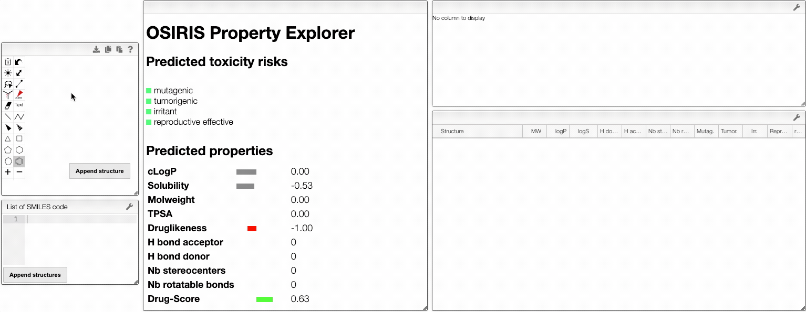

# Property explorer

## Properties of a molecule

In this view, you would use OSIRIS Property Explorer provided by Thomas Sander to get access to predicted properties of molecules. By drawing a molecule, OSIRIS Property Explorer calculates on-the-fly various drug-relevant properties such as the octanol-water partition coefficient (log P) or the druglikeness of the compound.

Prediction results are valued and color coded. Properties with high risks of undesired effects like mutagenicity or a poor intestinal absorption are shown in red. Whereas a green color indicates drug-conform behavior.

Several properties are predicted:

- Properties from Lipinski's rule of five (log P, molecular weight, hydrogen bodn acceptors and donors)
-

## Comparison of molecules

You can also compare several molecules. In order to do this, draw your molecule in the home page, click on `Compare molecules` and append your structure. The structure appears in the table on the right. Then, draw the structure of a new molecule and click on `Append structure`. The new structure appear in the same table as the previous one and their properties are compared in an interactive parallel coordinates plot. You can also append new molecules by writing their SMILES and clicking on `Append structure`.

> > > > > > > Lipinski_property
