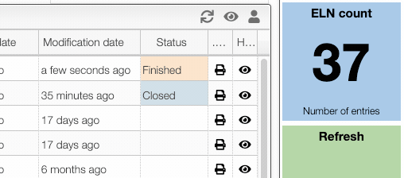

# TOC of ELN entries

This view allows to manage the entries in the Electronic Laboratory Notebook.

From there you can:

- Search by entry code or entry description
- Add a new entry
- Duplicate an existing entry
- Hide / Show some of the entries

## Show / Hide entries

You may want to hide some of the entries because they failed or didn't provide useful information.

To hide an entry click on the `eye` icon in the list of entries.

You can also show all the hidden entries by clicking on the `eye` in the window header. You have then the possibility to unhide entries.

## Searching

Using the search box you can a keyword. This will search in:

- reaction code
- reagents code, name, mf, rn
- products batch, mf
- reaction description

You can also make advance queries by specifying a field like for example:

- `yield:>0`: yield over 0. You need to put `0.1` for 10% !!
- `reference:LP12`: all the entries having in the reference `LP12`
- `title=test`: all the entries having in the title the word `test`
