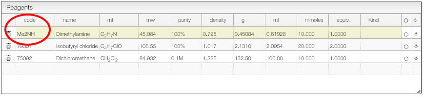
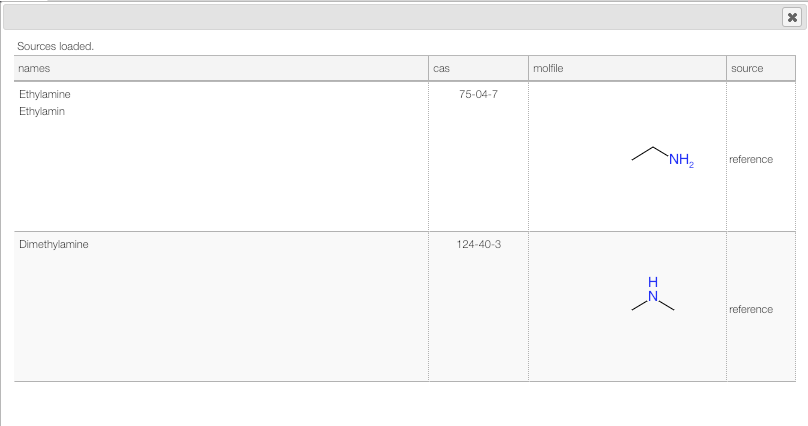

## Lookup for a product

You should use the column `code` in order to lookup for a product.

In this column you may either enter:

- cas number
- product name
- molecular formula
- **product code** (practical to retrieve a product you synthesized before)

A molecular formula may be entered the way a chemist think about it. Meaning you are allowed to use groups and parenthesis like `(MeCH)2NH`.

Once the string entered press `tab` in order to trigger the lookup. The system will search in a reference database of 400000 molecules and also for all the internal products you have access to.

Click on the right product to copy the name, structure and density.

