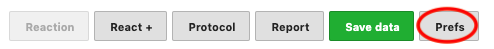

## Define snippets / User preferences

To define `snippets` you should click on the `Prefs` button.

From this screen you can create an unlimited number of snippets.

Each snippet should be associated with a key composed of lowercase letters.

Don't forget to `Save preferences` !
