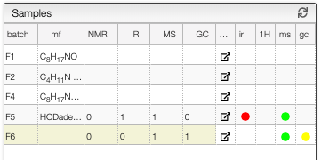

## Check analysis

A reaction contains various sample. Sample can be either isolated and purified products or just any analysis related to the reaction.

A sample contains all the analysis related to it (NMR, GC, IR, Mass, etc) and each of the analysis have a specific view to process them.

It is now possible to jump directly to the corresponding analysis view by clicking on the corresponding color bullet from the sample list.
