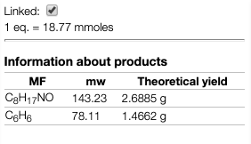

## Products theoretical information

When you draw products of reaction the application will calculate continuously the expected quantities for 100% and one equivalent.

This value is also updated when you change the quantities in the reagent table.

