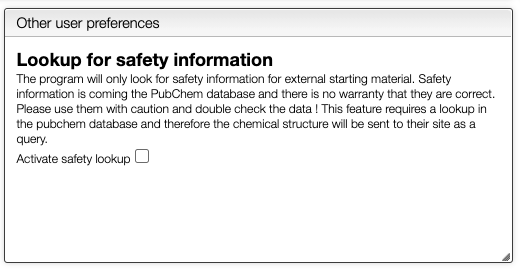
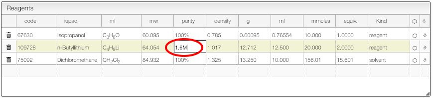

import JSMETip from '../../includes/jsme-tip.md'

# Add and modify an ELN entry

## Userguide

This view shows a concept of an electronic laboratory notebook done directly in the visualizer.

### JSME tricks

JSME is a simple to use and powerful tool developed by Peter Ertl and Bruno Bienfait.

It is possible to select a molecule by going hover it. Once selected you can move this molecule \(just click around and drag the mouse\).

Even if the molecule does not appear as being selected you can still act on it. In instance you can:

- copy to the molecule to the other side of the reaction by clicking on the arrow.
- click on the white rectangle to delete this selected molecule

<JSMETip/>

### Reagents table calculator

The reagent calculater is connected to databases and can retrieve information about a chemical. For instance in the "code" you may enter a molecular formula, name or cas number and the system will look for commercially available chemicals. You can then select the molecule you want to add in the table.

- If you enter a new sample and change the molecular formula, molecular weight will be automatically calculated. In the molecular formula you may enter groups like Et, Ph, Ts, ... as well as parenthesis..
- The purity may be enter in %, M \(molar\) or L \(loading\). Molar is expressed in mmoles / mL and loading is expressed by mmoles / g and is practical for solid phase synthesis.
- The first reagent for which you add a quantity will be defined as 1 equivalent. You may still change this anytime. After defining the first quantity you will probably want to define the other reagents from the equivalent columns rather than the quantity \(except probably for the solvent\).
- One the equivalents are specified those samples are "connected". This means that if you change the quantity of one of the reagents all the quantity will change.
- It is possible to remove the link between the reagents by unselecting the "Link" checkbox.

### Drag drop images

You may just copy / paste an image of the "Drop or paste" zone and it will be inserted in the procedure.

### Calculate solvent volume to reach specific concentration

For some reaction it is important to calculate the solvent to reach a specific concentration.

The reagent table allows to do this:

1. For the solvent enter as number of equivalent '1'
2. Enter the concentration you want to achieve in the 'Purity' column.

### Safety information

When looking for commercial products you may decide to also lookup for safety information in PubChem.

To activate this feature, click on `prefs` and check `Activate safety lookup`. Don't forget to save your new preferences !

It is also possible to directly edit the safety information by clicking in the `Hazard pictogram` column and entering the various GHS pictogram code separated by a comma.

More information from PubChem about the chemical can also be found by clicking on the 'i' icon.

## Specifying the purity of a reagent

The purity of a reagent may be specified using 3 possibles units:

- `%`: purity as mass ratio
  - like 40% HNMe2 in water
- `M` (or `mM`): moles/liter (or mmoles/liter)
  - like 1.6M BuLi
- `L`: loading: mole/kg
  - useful for solid phase synthesis

