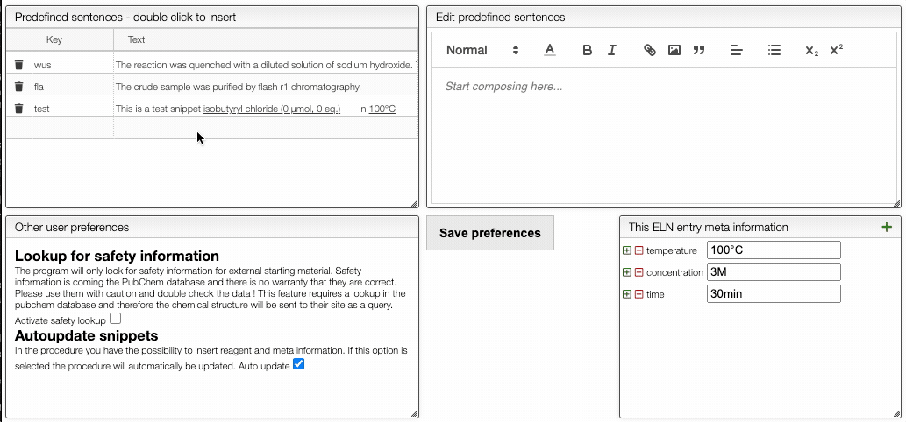
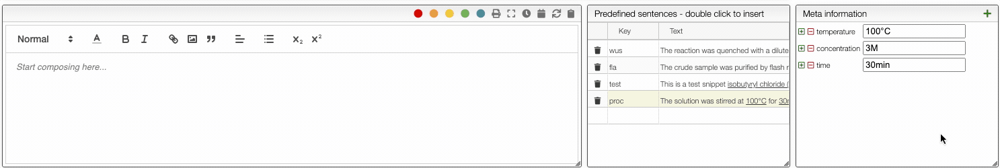
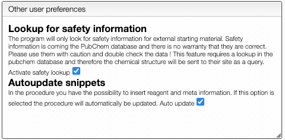
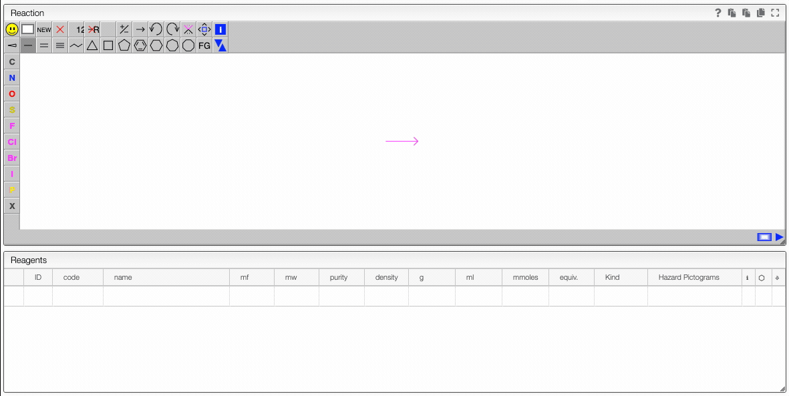
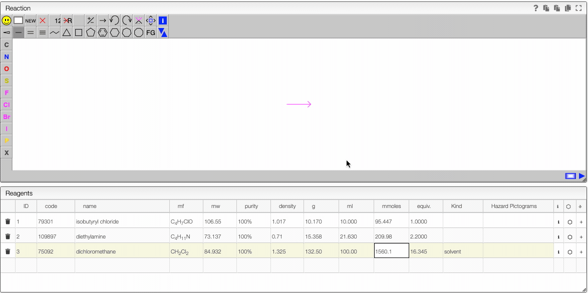

import TOCInline from '@theme/TOCInline';
import JSMETip from '../../includes/jsme-tip.md'

<TOCInline toc={toc} />;

# Introduction

This view allows to create and edit an electronic laboratory notebook entry.

## User preferences

To define user preferences and`snippets` you should click on the `Prefs` button.

To define a snippet first associate to it a `key` that is composed of lowercase letters and the define the corresponding sentence. The sentence may contain not only reagents like `r1`, `r2` but also meta information that can be inserted using `_` followed by the meta field name like `_temperature` for example. If a snippet contains those field you will be able to update their values automatically.

Each snippet should be associated with a `key` composed of lowercase letters.

You can then insert snippets by typing their `key` that will be automatically replaced and updated with the current values.

You can also define if you would like to have automatic safety lookup in PubChem as well as automatic updates of the reagents and meta information that has been inserted in the procedure.

Don't forget to `Save preferences` !

## Organic reactions

When preparing a new organic reaction the idea is first to add the different reagents and then to fill the schema with simple clicks. The concept behind it is that either the product is commercially or it was synthesized before. Therefore all the chemical structures of the reagents are already known.

### Lookup for a product

You should use the column `code` in order to lookup for a product.

In this column you may either enter:

- cas number
- product name
- molecular formula
- **product code** (practical to retrieve a product you synthesized before)

A molecular formula may be entered the way a chemist think about it. Meaning you are allowed to use groups and parenthesis like `Me2CHCOCl`.

Once the string entered press `tab` in order to trigger the lookup. The system will search in a reference database of 400000 molecules and also for all the internal products you have access to.

Click on the right product to copy the name, structure and density.

### Defining the quantities

The reagent calculater is connected to databases and can retrieve information about a chemical. For instance in the "code" you may enter a molecular formula, name or cas number and the system will look for commercially available chemicals. You can then select the molecule you want to add in the table.

- If you enter a new sample and change the molecular formula, molecular weight will be automatically calculated. In the molecular formula you may enter groups like Et, Ph, Ts, ... as well as parenthesis..
- The purity may be enter in %, M \(molar\) or L \(loading\). Molar is expressed in mmoles / mL and loading is expressed by mmoles / g and is practical for solid phase synthesis.
- The first reagent for which you add a quantity will be defined as 1 equivalent. You may still change this anytime. After defining the first quantity you will probably want to define the other reagents from the equivalent columns rather than the quantity \(except probably for the solvent\).
- One the equivalents are specified those samples are "connected". This means that if you change the quantity of one of the reagents all the quantity will change.
- It is possible to remove the link between the reagents by unselecting the "Link" checkbox.

### Drawing the schema

JSME is a simple to use and powerful tool developed by Peter Ertl and Bruno Bienfait. In order to draw the reaciton we will start by adding the chemical structures from the reagent table.

It is possible to select a molecule by going hover it. Once selected you can move this molecule \(just click around and drag the mouse\).

:::info Molecule selection
Even if the molecule does not appear as being selected you can still act on it. In instance you can:

- copy to the molecule to the other side of the reaction by clicking on the arrow.
- click on the white rectangle to delete this selected molecule

:::

<JSMETip/>

### Drag drop images

You may just copy / paste an image of the "Drop or paste" zone and it will be inserted in the procedure.

### Calculate solvent volume to reach specific concentration

For some reaction it is important to calculate the solvent to reach a specific concentration.

The reagent table allows to do this:

1. For the solvent enter as number of equivalent '1'
2. Enter the concentration you want to achieve in the 'Purity' column.

### Safety information

When looking for commercial products you may decide to also lookup for safety information in PubChem.

To activate this feature, click on `prefs` and check `Activate safety lookup`. Don't forget to save your new preferences !

It is also possible to directly edit the safety information by clicking in the `Hazard pictogram` column and entering the various GHS pictogram code separated by a comma.

More information from PubChem about the chemical can also be found by clicking on the 'i' icon.

## Specifying the purity of a reagent

The purity of a reagent may be specified using 3 possibles units:

- `%`: purity as mass ratio
  - like 40% HNMe2 in water
- `M` (or `mM`): moles/liter (or mmoles/liter)
  - like 1.6M BuLi
- `L`: loading: mole/kg
  - useful for solid phase synthesis

