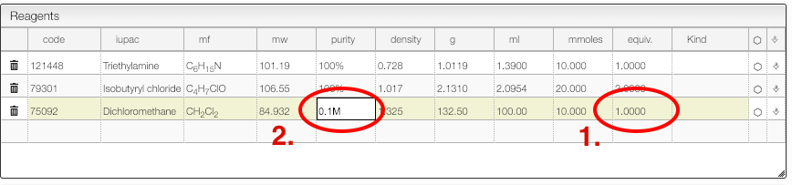
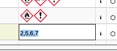

import TOCInline from '@theme/TOCInline';
import Reaction from './includes/reaction/README.md'
import InsertSnippets from './includes/insertSnippets/README.md'
import Preferences from './includes/preferences/README.md'

<TOCInline toc={toc} />;

# Introduction

This view allows to create and edit an electronic laboratory notebook entry.

## User preferences

<Preferences/>

## Organic reaction

<Reaction/>

### Couple of tips about organic reactions

:::tip Purity
You could check more example about [purity here](includes/purity/README.md).
:::

:::tip Theoretical information
The system will calculate continuously the molecular formula of all the reagents and products. More information can be [find here](includes/productsInfo/README.md).
:::

:::tip Mixture of solvents
There is an easy to deal with mixture of solvents. More information can be [find here](includes/mixtureSolvents/README.md).
:::

:::tip Many times the same reagent
In some cases it is required to add many times the same reagent. More information can be [find here](includes/multipleTimes/README.md).
:::

:::tip Copy structure of the product to a sample
In some cases it is required to copy manually the structure of a reaction product. More information can be [find here](includes/copyProduct/README.md).
:::

## Insert snippets, reagents and meta information

<InsertSnippets/>

## Miscellaneous

### Drag drop images

You may just copy / paste an image of the "Drop or paste" zone and it will be inserted in the procedure.

### Calculate solvent volume to reach specific concentration

For some reaction it is important to calculate the solvent to reach a specific concentration.

The reagent table allows to do this:

1. For the solvent enter as number of equivalent '1'
2. Enter the concentration you want to achieve in the 'Purity' column.

### Safety information

When looking for commercial products you may decide to also lookup for safety information in PubChem.

To activate this feature, click on `prefs` and check `Activate safety lookup`. Don't forget to save your new preferences !

It is also possible to directly edit the safety information by clicking in the `Hazard pictogram` column and entering the various GHS pictogram code separated by a comma.

More information from PubChem about the chemical can also be found by clicking on the 'i' icon.
