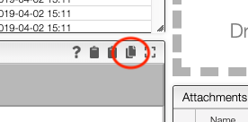
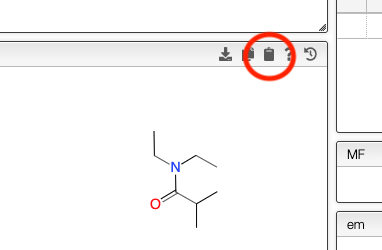

# Copy product as molfile

If a sample was created using another method than from the reaction the chemical structure, molecular formula and molecular weight will not be copied automatically. This is the case for example when a sample is analysed by NMR and the sample is created automatically during importation.

There is now a simple way to copy / paste the chemical structure of the product.

The product is copied as a molfile and can be paste in a sample entry.

It could be paste for example in ChemDraw using `Edit -> Paste Special -> Mol text`
