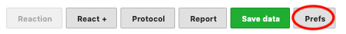
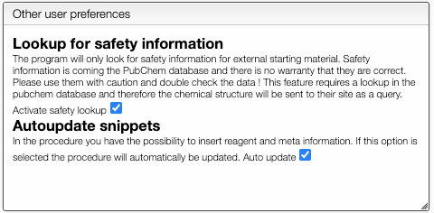

To define user preferences and `snippets` you should click on the `Prefs` button.

### Predefined sentences

To define a snippet first associate to it a `key` that is composed of lowercase letters and then define the corresponding sentence. The sentence may contain not only reagents like `r1`, `r2` but also meta information that can be inserted using `_` followed by the meta field name like `_temperature`. If a snippet contains those fields you will be able to update their values automatically.

Each snippet should be associated with a `key` composed of lowercase letters.

You can then insert snippets by typing their `key` that will be automatically replaced and updated with the current values.

### PubChem lookup and autoupdate

You can also define if you would like to have automatic safety lookup in PubChem as well as automatic updates of the reagents and meta information that has been inserted in the procedure.

Don't forget to `Save preferences`!
