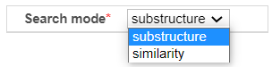
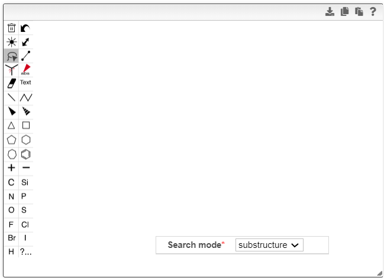
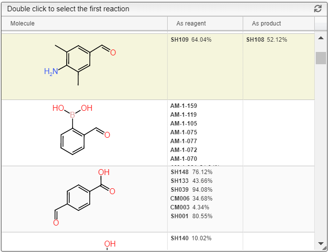
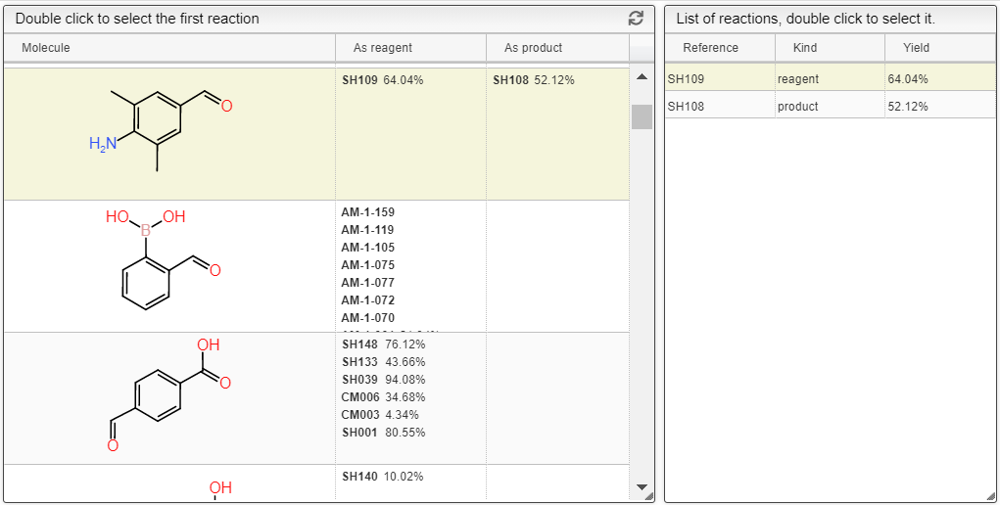
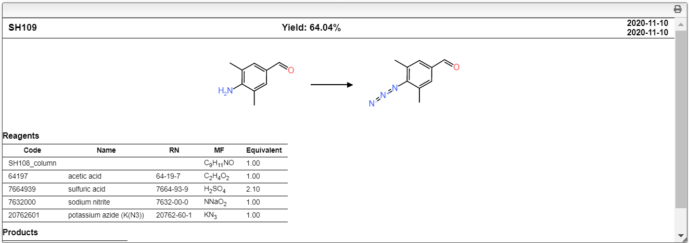

# Search reactions by structure

This tool could be used to search the chemical reactions you want by only draw a chemical structure even though substrate or product that might be useful for your synthesis.

## How to use

First, choose the filter group options at the group dropdown box on the top left:

- `all` : searches in all the reactions you have access to
- `mine` : searches in all reactions you have created
- search for a specific group to which you belong.

Next, choose between the two search modes at the search mode dropdown box on the bottom in left module:

- `substructure` : search for samples containing the given substructure
- `similarity` : search for samples with a similar structure.

Then, draw a structure in the left module.

The list of matching structures would be displayed at the center module.
You can also know which of the structures is reagent or product by checking the right two columns.

After you selected the one you want, the right module will display the list of samples associated with the selected structure including reference (name), kind (reagent/product) and yield.

When you click the one you want, you will see a preview of the reaction at the bottom module.

Double clicking the row you want in the **right module** will take you back to the main tab, with the corresponding sample selected in the list of selected samples.

**or**

Double clicking the row you want in the **center module** will take you directly to the first matching sample.

Structure search uses the algorithm implemented in DataWarrior. They are open source and available as part of openchemlib (https://github.com/actelion/openchemlib, https://github.com/cheminfo/openchemlib-js).
