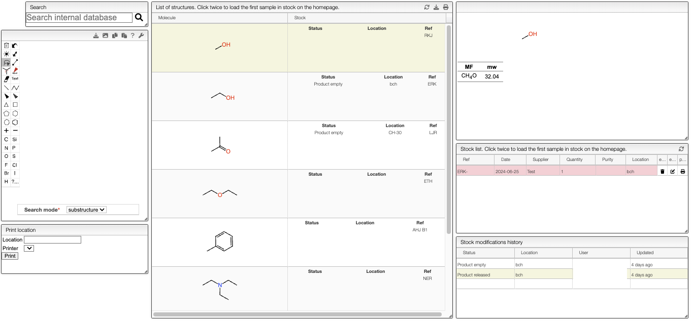
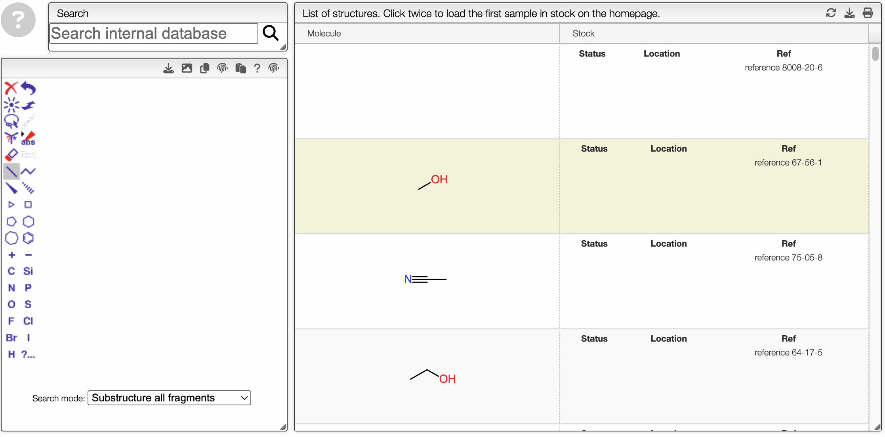
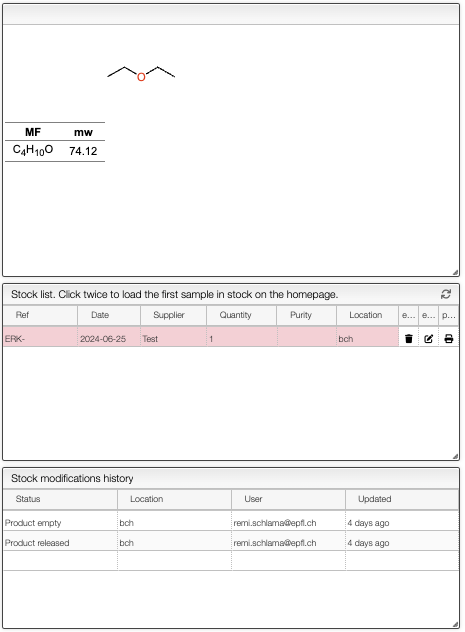
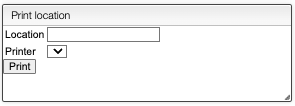

import AQF from "../../includes/advanced_query_features/README.md";

# Search Stock

`Search Stock` is a tool to manage the stock of chemical compounds in your lab. The view is divided into three main sections: the search and print section on the left, the list of the compounds in the middle, and the details of the selected compound on the right.

## Searching for a Compound

To search for a specific compounds within the stock, you can draw a structure on the left panel and either select the `substructure` or the `similarity` search. The `substructure` search will return all compounds that contain the drawn structure, while the `similarity` search will return all compounds that are similar to the drawn structure. It is also possible to search by a name in the search bar.

Once the substructure or the similar structure is drawn, the search results will be displayed on the right panel. It is possible to click on one of the compounds to get additional information.

<AQF/>

## Stock Information

On the right panel, you can find all the information about the selected compound. The information includes the molecular formula, the structure, the molecular weight, the quantity, the location, the purity, and many more details that can be provided.

:::note
Note that the products are grouped by structure, a given structure can have multiple references representing different batches of the same compound.
:::

It is easy to change the status of a product. You can change the quantity, the location, the purity, whether the product is available or not. The modifications will be saved in the `Stock modification history`.

The `Stock modification history` shows the history of the stock modifications. It is possible to see the status, the location, the user that made the modification and the date of the modification of the product.

## Print

To print the current state of the stock status for a specific compound, you can click on the `Print` button. This will create a PDF file with all the information about the compound. You can choose the printer and the location in the following panel.

