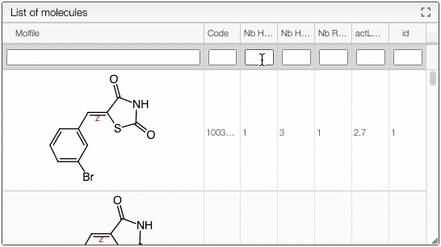

# Convert SDF files to a table

This tool allows to quickly open large (up to 400Mb) SDF files. 

Drag and drop or paste your SDF file and it will be displayed as a table containing all the properties found in the file (structure of the molecule, number of H donors, acceptors...). 

:::tip
Click on `Demo` to familiarize yourself with the tool. A list of 3543 organic molecules will be uploaded. 
:::

You can apply filters on your list of molecules by selecting a specific number or range of numbers for one or more properties. Use, for example, 1..3 to select a range of number where the limits are included, or >, <, >= and <= to define an upper or lower bound. 

