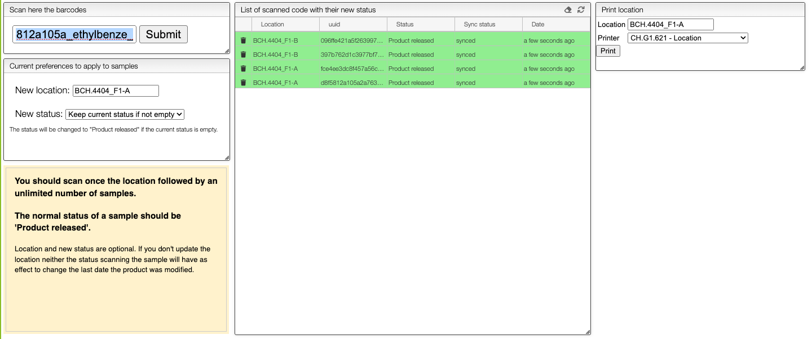
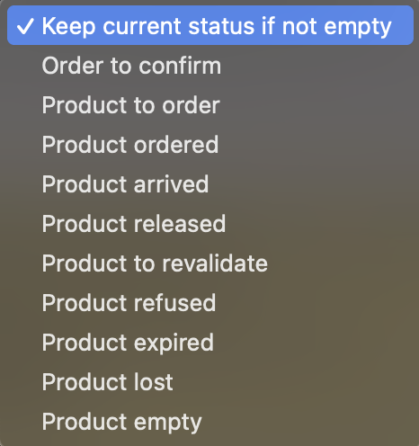
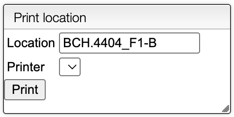
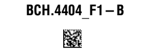
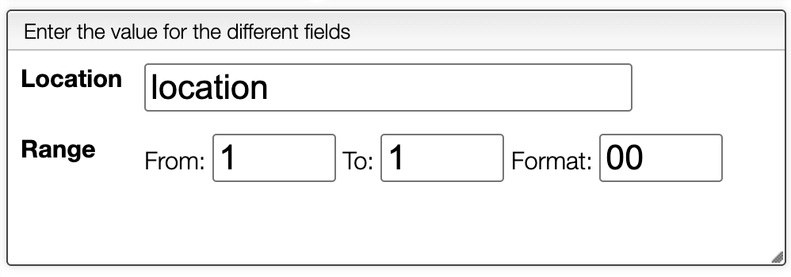

# Update Stock

## Update the location of existing products

To change the location of a product already in stock, place the cursor in the input field labeled `scan`, then scan the product label first and immediately scan the label of the new location. The product's location will be updated to the scanned location and the table in the middle panel will refresh to show the new location.

:::warning Important
Before scanning, make sure:
- The input field `scan` has the focus.
- The scanner is configured with the correct keyboard layout (azerty, qwerty, etc.).
- The scanner is configured to send an `Enter` key after each scan.
:::

## Update the stock status

The saved product's status can be updated by selecting the corresponding `status` and scanning the label of the product. The location will not matter since the product is already in the stock.

## Create a new location label

It is possible to generate a label for a new location. To do so, go on the right panel `Print location`, enter a meaningful name for the location (use room number, shelf number, `-`, `.`, etc.), select the printer and click on the `Print` button.

This will print a label that can be scanned to add a new location in the stock.

For more convenience, you can also print labels for multiple locations by selecting a printer and clicking on the `location + range`. This will ask for the location, the range and the format of the labels.

The table below will show the list of labels that will be printed.