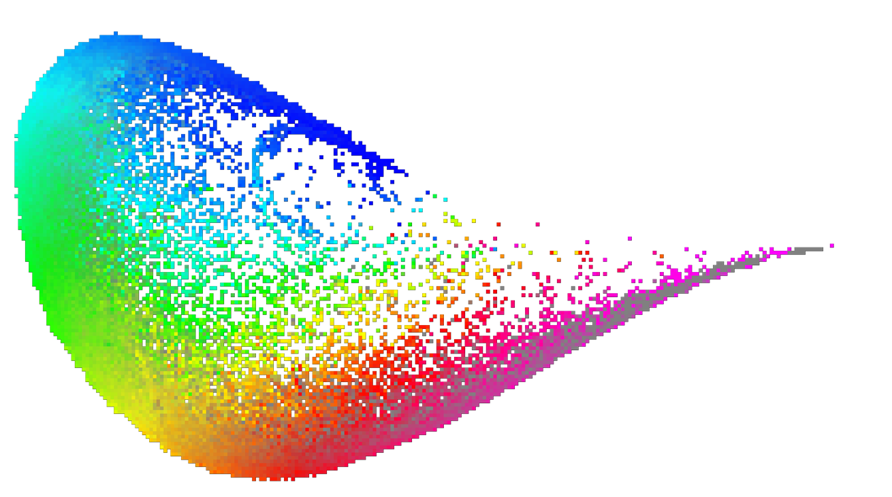
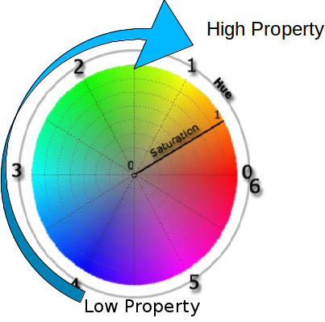
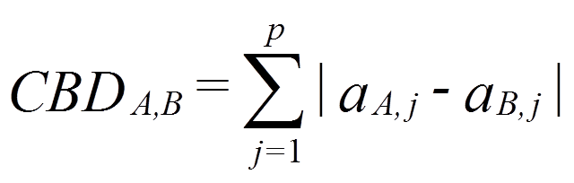
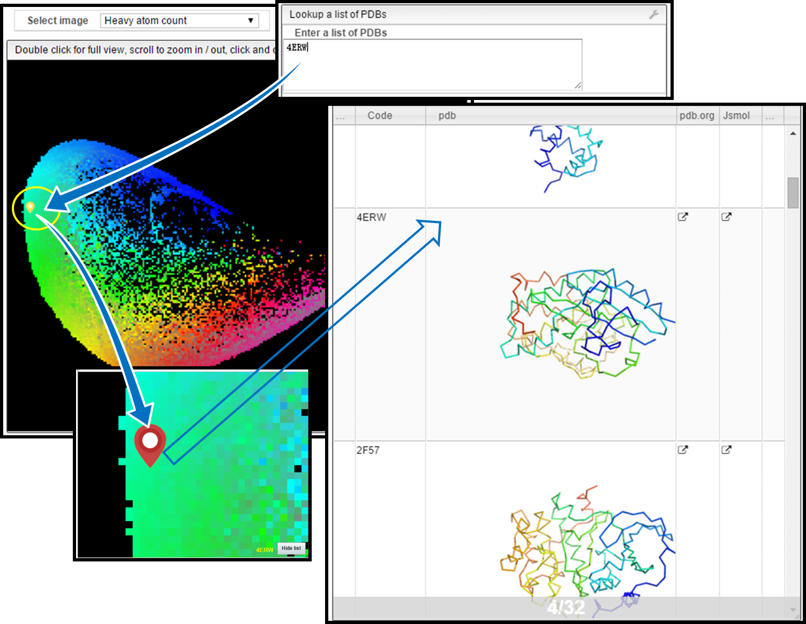
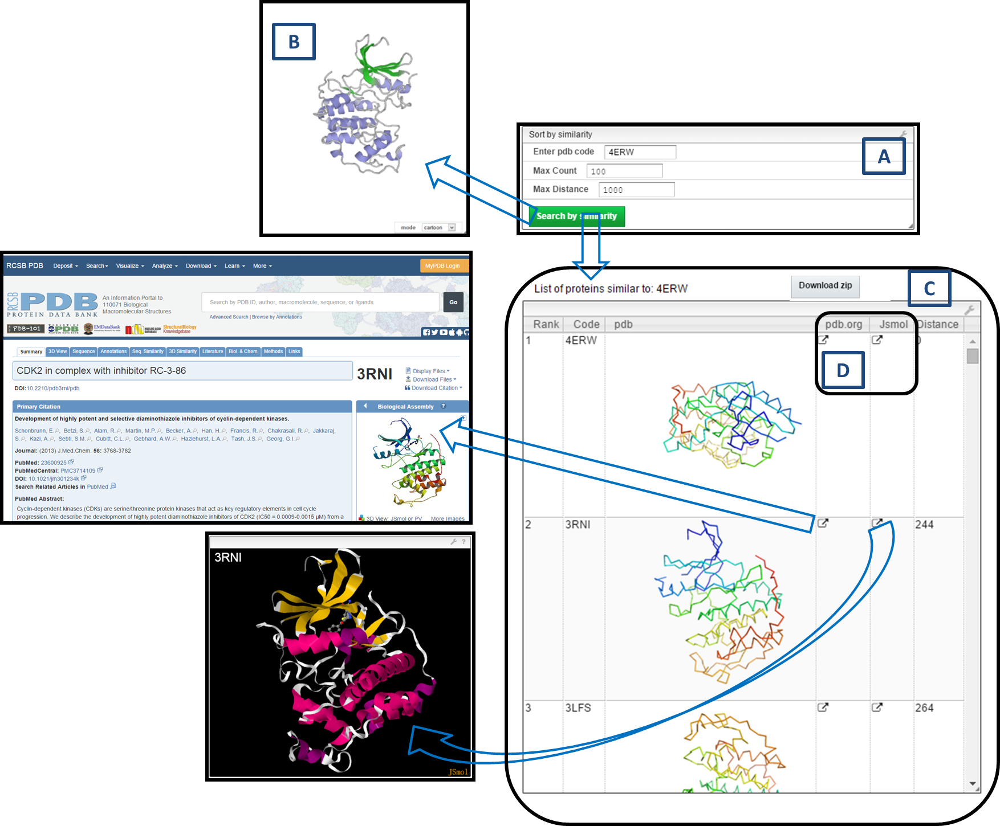

# PDB-Explorer

## Table of Contents

- [Video](#video)
- [Introduction](#introduction)
- [Functionalities in PDB-Explorer](#functionalities-in-pdb-explorer)
- [Example with PDB code 4ERW](#example-with-pdb-code-4erw-locate-molecule--similarity-search)
- [Supported Browsers and Technical Support](#supported-browsers-and-technical-support)
- [References](#references)

<!-- video does not work yet -->
<!-- ## Video

<video controls width="100%">
  <source src="PDB-explorer.mp4" type="video/mp4"/>
  Your browser does not support the video tag.
</video> -->

---

## Introduction

**PDB-Explorer** is a web application for the interactive visualization of chemical space of the RCSB Protein Data Bank (PDB), characterized by protein shape fingerprint (3DP) and shape similarity search for molecules in PDB.
The chemical space is represented as **3DP PCA maps**. PDB-Explorer contains X-ray structures from PDB, updated daily with the latest additions.

### Molecules in PDB-Explorer

- X-ray molecules are biological assemblies defined by the author.
- Ribbon images are generated with **PyMOL**.
- 3D models can be viewed in **PV viewer** or **JSmol**.
- If a PDB entry has no secondary structures or contains only alpha carbons, default cartoon mode may not display (e.g. `1O55`, `1IVI`).
  In such cases, switch PV display mode to **lines**. JSmol may sometimes detect secondary structures automatically.

### Protein Shape Fingerprint (3DP)

3DP captures the spatial distribution of **shape, hydrophobicity, and charges** across a wide size range.
See [References](#references) for details.

### 3DP PCA Maps

Maps represent PC planes (PC1–PC2, PC2–PC3, or PC1–PC3) from PCA of the 200-dimensional 3DP similarity space.

Each map is a **300 × 300 grid**, color-coded by properties such as:

- Heavy atom count
- % Hydrophobic atoms
- % Negative charge atoms
- % Positive charge atoms
- Molecular Volume Occupancy (MVO)
- Normalized PMI (nPMI)
- Occupancy (number of molecules at that point)

**Example: PC1–PC2 map color-coded by heavy atom count**

*Figure 1: 3DP PCA map color coded by Heavy Atom Count property*

### Color Coding

We use **HSL (Hue, Saturation, Luminance)** color space:

*Figure 2: HSL color space*

- Hue → base property value
- Saturation → standard deviation
- Luminance → occupancy (number of molecules)

Color gradient goes from **blue → cyan → green → yellow → red → magenta** as property value increases.

### Similarity Measure

Similarity is quantified with **City Block Distance (CBD)**.
For two molecules *A* and *B* with *P* dimensions:

Results are sorted by increasing CBD distance.

## Functionalities in PDB-Explorer

### Choose the Map

- Select available maps from the dropdown menu.
- Default = *Heavy atom count map*.

### Mouse Controls

- **Mouse move:** shows PDB code, coordinates, ribbon image, average, and deviation.
- **Mouse wheel:** zoom in/out.
- **Double click:** reset to full view.
- **Drag:** move map.
- **Single click:** show PDB entries at the clicked pixel.

### Protein List

- Lists molecules at selected map points.
- Options: **JSmol** (3D viewer) or **pdb.org** (external link).
- You can also trigger similarity search from a selected entry.

### Download

- **Download Zip**: get 3D coordinates of all molecules at a map point.

### Upload Molecule

- Drop/upload your own `.pdb` file.
- Displays its position (black droplet).
- Searches for similar molecules in PDB automatically.
- **Note:** only atoms labeled `ATOM` are considered. Non-standard residues must be changed from `HETATM` to `ATOM`.

### Lookup PDBs

- Locate one or more PDB codes on the map (yellow droplets).

### Sort by Similarity

- Enter PDB code + search options:
  - **Max Count** = number of similar molecules to retrieve
  - **Max Distance** = threshold for similarity (default = 1000)
- Results are ranked by similarity, with the query molecule marked (blue droplet).

### Help

- Opens this help document in the browser.

## Example with PDB code 4ERW (Locate Molecule / Similarity Search)

**4ERW** = Cyclin-dependent kinase 2.

### 1. Locate Molecule

- Enter `4ERW` in the *Lookup PDBs* field.
- Its position appears as a **yellow droplet**.

### 2. Show Molecules in the Same Pixel

- Single-clicking the yellow pixel shows all molecules in that map cell (**red droplets**).
- Example: 32 molecules share the same pixel as `4ERW`.

### 3. Similarity Search

1. **Enter PDB code** = `4ERW`.
2. **Select options:**
   - Max Count = 100
   - Max Distance = 1000 (default)
3. **Click Search by Similarity**.
4. **Results:**

- **A**: Query entry + search options
- **B**: PV viewer shows ribbon structure of `4ERW`
- **C**: Similar molecules list (code, image, rank, distance)
- **D**: Links → *pdb.org* (details) or *JSmol* (3D structure)

## Supported Browsers and Technical Support

- Best in **Chrome (v42+)**
- Also supported: **Firefox (v36)**, **Safari 9 (preview)**
- Not yet supported: Safari 8, Internet Explorer, Edge

For suggestions/questions: [xian.jin@dcb.unibe.ch](mailto:xian.jin@dcb.unibe.ch)

---

## References

- [RCSB Protein Data Bank](http://www.rcsb.org/)
- [The Protein Data Bank. Nucleic Acids Res. 2000, 28, 235-242](http://nar.oxfordjournals.org/content/28/1/235.long)
- [The MQN-Mapplet: Visualization of Chemical Space. J. Chem. Inf. Model. 2013, 53, 509-518](http://pubs.acs.org/doi/abs/10.1021/ci300513m)
- [Stereoselective virtual screening with atom pair 3D-fingerprints. J. Cheminform. 2015, 7, 3](http://www.jcheminf.com/content/7/1/3)
- [Similarity-based data-fusion approach. Chem. Biol. Drug. Des. 2007, 70, 393-412](http://onlinelibrary.wiley.com/doi/10.1111/j.1747-0285.2007.00579.x/abstract)

