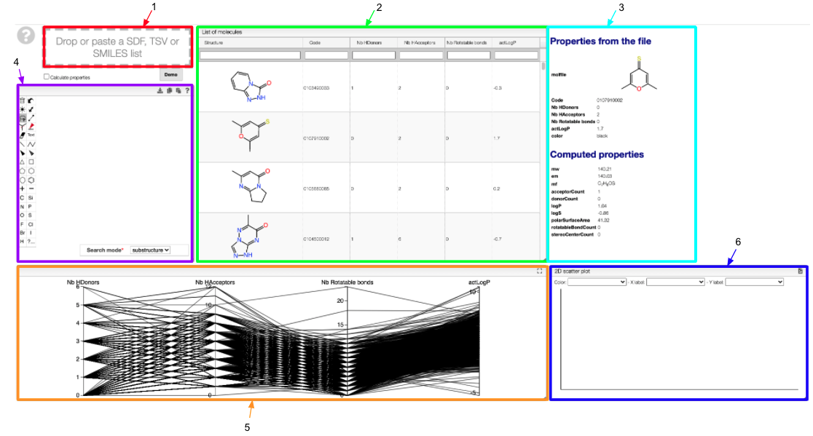
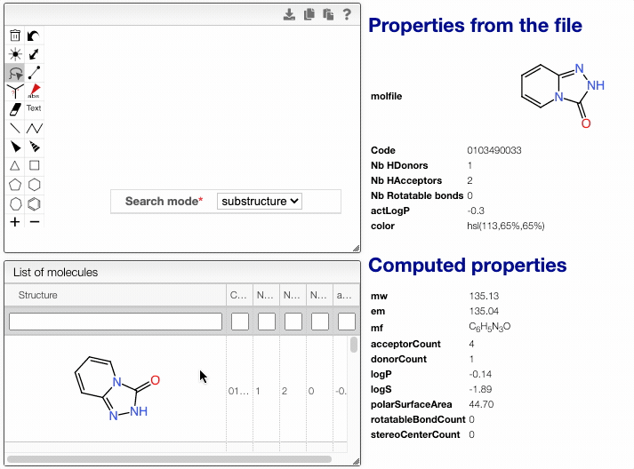
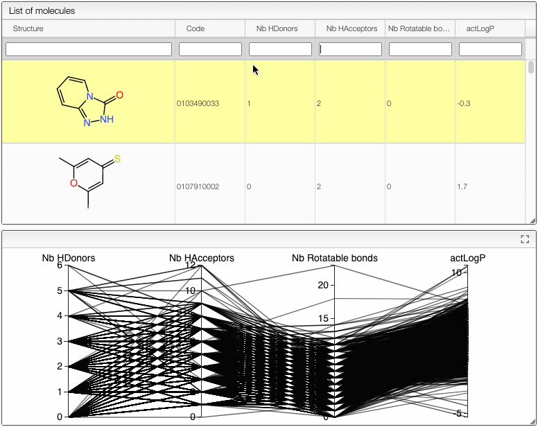
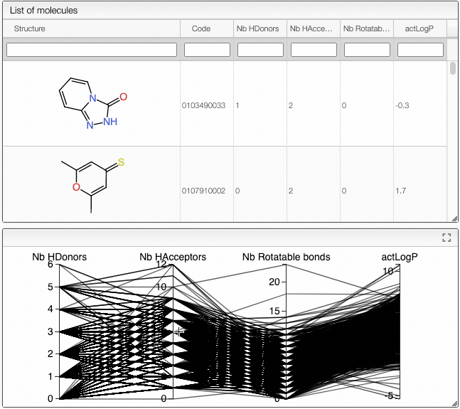
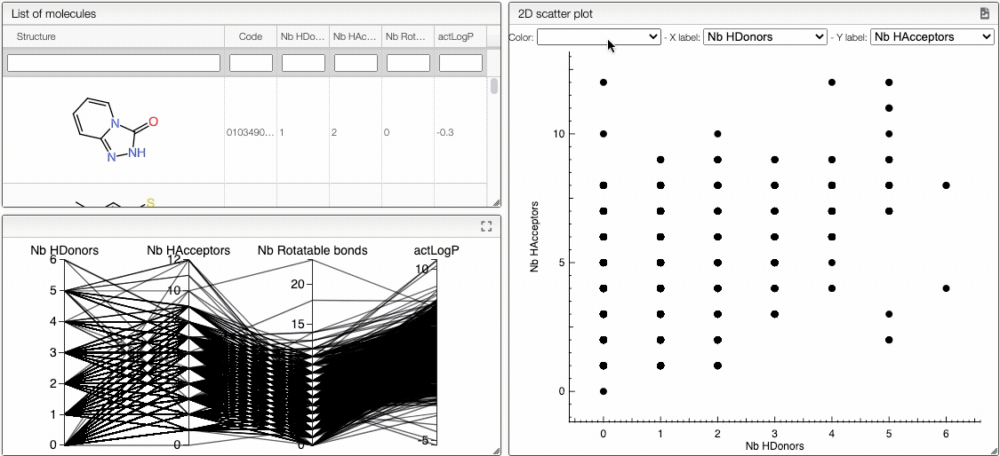
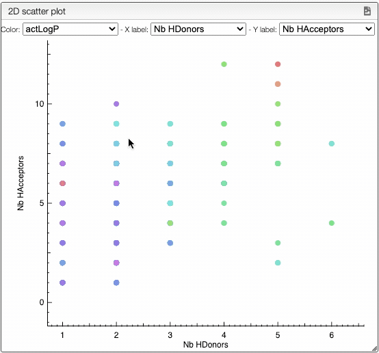

# Explore SDF files

This tool allows to explore a SDF file and search by substructure or Lipinski parameters.

## Overview 

1. Drag and drop or paste your list of molecules. SDF, [TSV](https://en.wikipedia.org/wiki/Tab-separated_values) and SMILES are supported. 
2. Your list of molecules is displayed as a table containing their structure, code, and other information such as the number of H donors or acceptors in the molecule.
3. Properties extracted from the file and computed for a specific molecule. In the computed properties, you would find molecular weight, exact mass, molecular formula, as well as [Lipinski properties](https://en.wikipedia.org/wiki/Lipinski%27s_rule_of_five) of the molecule. 
4. Substructure or similarity search on your list of molecules. Draw a substructure and reduce your list of molecules to similar molecules or molecules containing the same pattern. The other tabs will automatically be updated. 
5. The properties displayed in tab 3 are shown in an interactive parallel coordinates plot. You can select molecules that have particular properties from this tab.  
6. You can create a 2D scatter plot with the properties displayed in tab 5 and color tabs 5 and 6 according to a specific property. 

:::tip
Click on "Demo" to familiarize yourself with this tool. The demo file contains 3543 organic molecules.
:::

:::caution 
If your list of molecules is in the TSV format, the file must contain a header line and a column named "smiles".
:::

## Search by substructure or similarity 

When you draw a substructure, the list of molecules will automatically update according to the search mode you chose. You can see the properties of a specific molecule by scrolling your mouse over it. The displayed molecule will be highlighted in the table. 

## Search by Lipinski parameters 

You can also select molecules according to their Lipinski parameters. To do so, you can either use the list of molecules or the interactive parallel coordinates plot. In the list of molecule tab, select a specific number or range for a property as shown below. Using the mouse over, you can highlight the properties of molecules in the interactive plot. 

:::tip 
To search molecules with specific properties, you can use: 
- an exact number (1,2,3...)
- a limit (>1, <=5, >=2...)
- a range (1..2, 0..3), for which the limits are included
:::

You are also allowed to select molecules directly from the interactive plot. Select vertically a range and click on the outside of the range to reset the selection. The list of molecules will automatically update. To see all the functionalities of the interactive plot, [click here](../../20_samples/30_Lipinski-search/README.md). 

## 2D scatter plot 

You can create a 2D scatter plot from the properties displayed in the interactive plot. Select your x and y coordinates, as well as the color of the points. The color will automatically be applied to the interactive plot. 
Using the mouse over in the 2D plot, you can highlight the molecule of interest in both the list of molecules and the interactive plot.

To analyze your plot, you can: 
- zoom in by selecting a portion of the plot
- zoom out progressively using SHIFT + double click
- translate the plot with SHIFT + drag 
- go back to the default position with one double click 

:::info 
The 2D scatter plot can be download as an SVG file by clicking on the  icon on the top right of the `2D scatter plot` tab. 
:::
