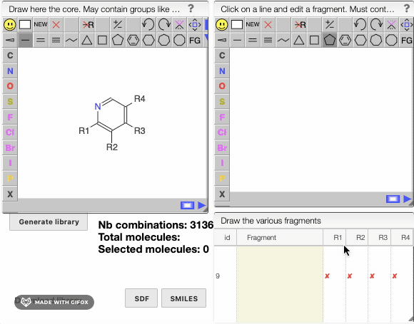
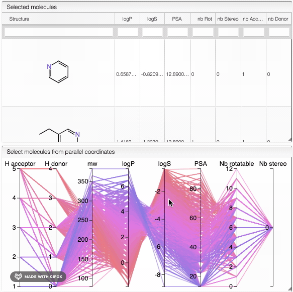

# Virtual combinatorial chemistry

In this view, you can generate a library of compounds based on a core molecule. 

Draw the core molecule that may contain commutable fragments using the R1, R2, R3,... Each group may only be present once. 

Select an empty space in the fragment list and draw the allowed fragment. The fragment must contain ONE "R" group that will be connected to the molecule. Choose which group among R1, R2, R3,... it may replace by selecting the corresponding column. The number of possible combinations will be automatically updated as you add a new fragment or change its position. Click on `Generate library` to display the list of molecules that correpond to your criteria. 

:::info 
A list of common fragments is already available. Select the fragment of interest and its desired position to update your library. 
:::

An interactive parallel coordinates plot that contains properties of the selected molecules would appear. Those properties are related to [Lipinski's rule of five](https://en.wikipedia.org/wiki/Lipinski%27s_rule_of_five). You would find the number of H donor and acceptor,  molecular weight, log P, log S, polar surface area, number of rotatable bonds and number of stereoisomers for each molecule. 

You can apply filters on your list of molecules by selecting a vertical range on the interactive plot. The list would automatically update. 
To know more about all the functionalities of the plot, [click here](../../20_samples/30_Lipinski-search/README.md). 

:::tip
You can download the generated library in two formats: SDF or SMILES.
:::
