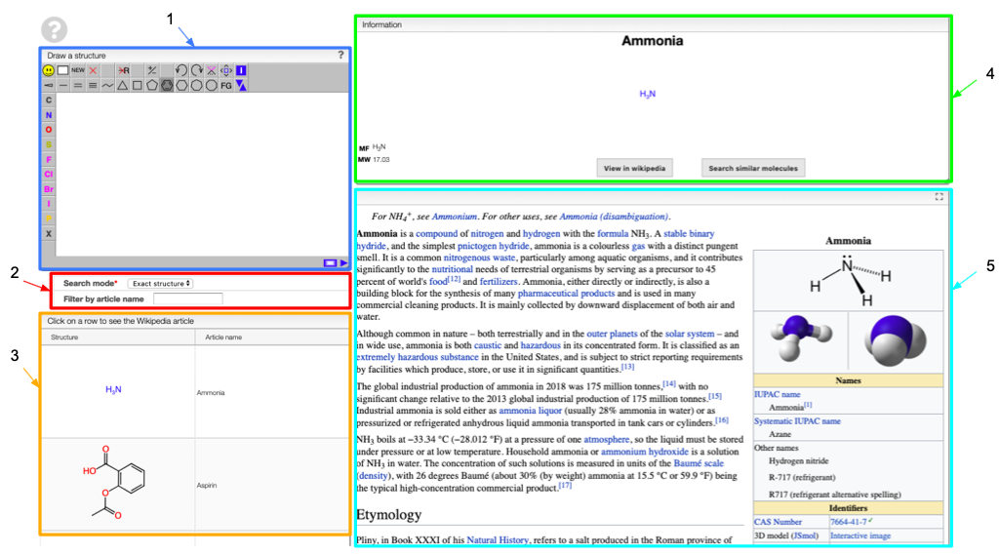
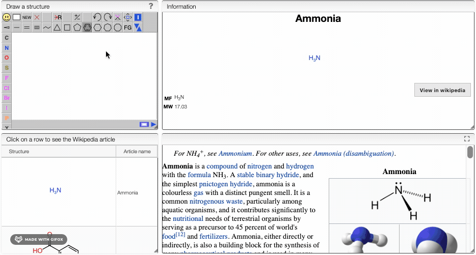

# Wikipedia chemical structures

Explore all the chemical structures present in the english version of Wikipedia. This database is updated daily. When you open this tool, all the chemical structures contained in the Wikipedia database will be loaded and displayed in a table with the correponding name of the article. 

## Overview

1. Draw a chemical structure to search in the database
2. Apply filters on your search
3. Table containing all the structures and corresponding article name that match your search
4. Basic information on the selected molecule: name, structure, molecular formula and molecular weight
5. Wikipedia article related to the selected molecule

## Search

When you draw a molecule in tab 1, the list of molecules will automatically update according to your search. The search mode can be set on substructure, exact structure or similarity search, depending on what your are looking for. You can also apply filter on the article name. 

The information tab and the wikipedia article shown correspond to the chemical structure that you drew. To get information about another molecule in the list, simply click on it. 

:::tip
By clicking on `View in wikipedia`, you will be directly redirected to the Wikipedia article of the displayed molecule. 
:::

If you want to know more about the Wikipedia Chemical Structure Explorer, look at one of the following links:
- https://github.com/cheminfo/wikipedia
- https://doi.org/10.1186/s13321-015-0061-y
