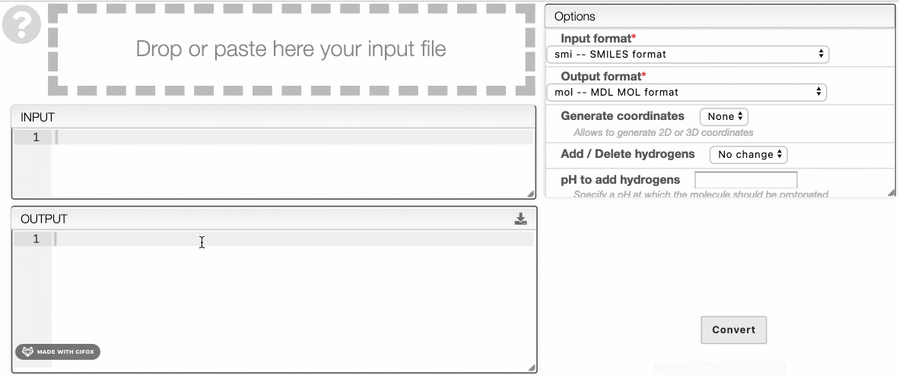

# Chemical structure file format conversion

This tool uses a service running [OpenBabel](http://openbabel.org/). You can use it to convert an input file into another format. 

If you have an input file, drag and drop or paste it in the box provided for that purpose. Then, select your input format (format of your file) and the desired input format and click on `Convert`. You can also enter a SMILES in the **Input** tab or draw a molecule in the tab below. An input file corresponding to the structure of the molecule will be automatically generated in the input format desired.

Once the output file is generated, you can download it by clicking on the  icon. 

:::tip
In the **Options** tab, you can generate 2D or 3D coordinates, add or delete hydrogens and specify a pH at which the molecule should be protonated.
:::