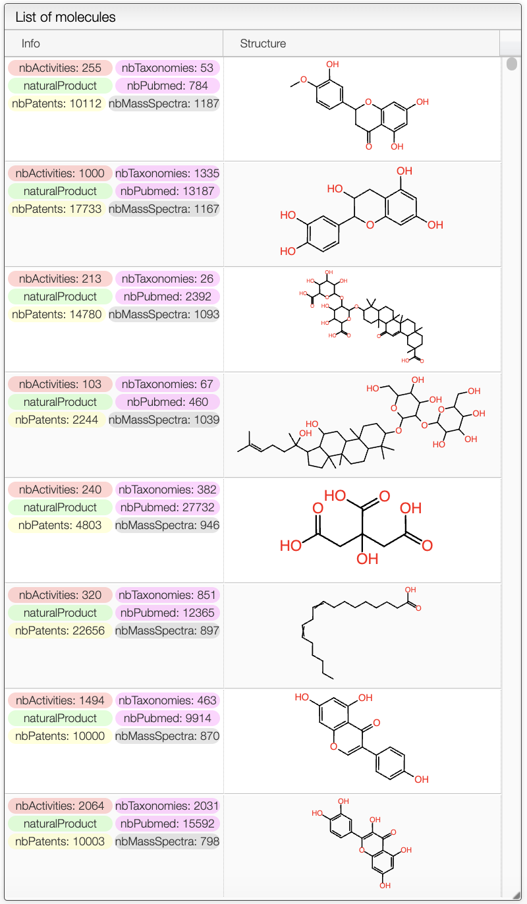

# Active or Natural Products Search

## Overview

The Active or Natural Products Search Interface allows users to search for general information about active or natural products. It is a web-based platform designed to access the underlying database at https://octochemdb.cheminfo.org.

## Search For Active or Natural Products

In the search panel, it is possible to search for active or natural products by name, mesh terms, bioassays, active against a specific target or the taxonomy.

## Search Results

The results of the search are displayed in a table. The table includes the structure of the compounds as well as tags such as the number of taxonomies, activities, patents, mass spectra... It also shows if the compounds is a natural product or not.

