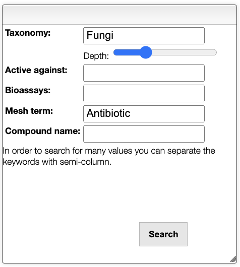
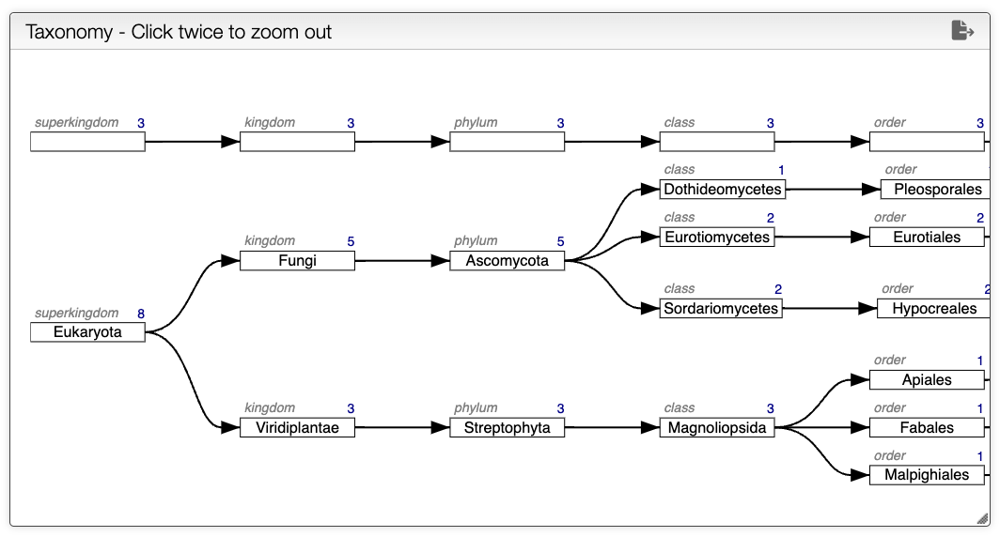

import Taxonomy from '../../includes/taxonomy/README.md';

# Active or Natural Products Search

## Overview

The Active or Natural Products Search Interface allows users to search for general information about active or natural products. It is a web-based platform designed to access the underlying database at https://octochemdb.cheminfo.org.

## Search For Active or Natural Products

In the search panel, it is possible to search for active or natural products by name, mesh terms, bioassays, active against a specific target or the taxonomy.

<Taxonomy/>

## Taxonomy
The right panel shows the detailed taxonomy tree of the selected compound. The depth of the tree can be controlled in the search panel. It is possible to zoom in by double right-clicking on the tree. The mouse wheel can also be used to zoom in or out.

