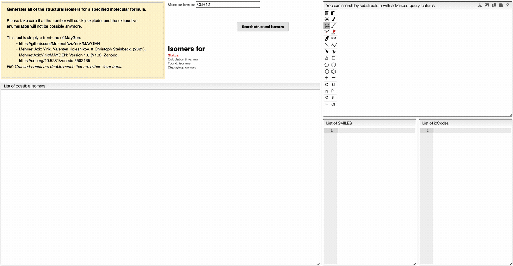

# Maygen: Isomers generation

## Introduction

Maygen is a tool to generate isomers from a molecular formula. It is based on the paper [MAYGEN: an open-source chemical structure generator for constitutional isomers based on the orderly generation principle](https://doi.org/10.1186/s13321-021-00529-9).

## Isomers generation

To generate isomers, you need to enter a molecular formula in the input field. The molecular formula is then parsed and isomers are generated.
The generated isomers are displayed in the table below the input field. It is possible to search by substructure in the generated isomers by drawing the substructure in the structure editor. The tool also provide a list of SMILES and idCodes of the generated isomers.

