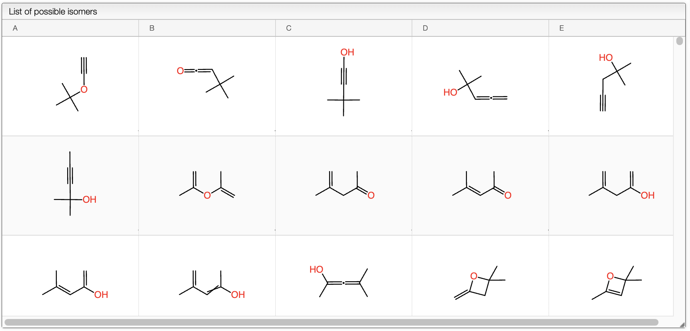
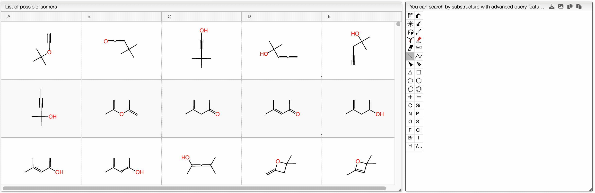

# Surge: Isomers generation

## Introduction

Surge is a tool to generate isomers from a molecular formula. It is based on the paper [Surge: a fast open-source chemical graph generator](https://doi.org/10.1186/s13321-022-00604-9).

## Isomers generation

This tool provides a list of options for the generation of isomers. The list of options is given in the panel shown below.

The options are as follows:

- **Molecular Fromula**: The molecular formula for which the isomers are to be generated.
- **Limit**: The maximum number of isomers to be generated.
- **Timeout**: The maximum time in seconds to generate isomers (maximum 30s).
- **Calculate IdCode**: Whether to calculate the idCode for each isomer.
- **Disallow triple bonds**: Whether to disallow triple bonds in the isomers.
- **Require Planarity**: Whether to require planarity in the isomers.
- **Limit 3 rings**: Limit the number of rings of length 3, with the format `max` or `min:max`.
- **Limit 3 rings**: Limit the number of rings of length 5, with the format `max` or `min:max`.
- **No small ring triple bonds**: Whether to disallow triple bonds in rings of size up to 7.
- **Bredt's rule one**: Whether to apply [Bredt's rule](https://en.wikipedia.org/wiki/Bredt's_rule) for two rings $ij$ with one bond in common (33, 34, 35, 36, 44, 45).
- **Bredt's rule two**: Whether to apply [Bredt's rule](https://en.wikipedia.org/wiki/Bredt's_rule) for two rings $ij$ with two bonds in common ($ij$ up to 56).
- **Bredt's rule three**: Whether to apply [Bredt's rule](https://en.wikipedia.org/wiki/Bredt's_rule) for two rings of size 6 sharing three bonds.
- **No K33 K24**: Whether to disallow K33 and K24 subgraphs.
- **No cone**: None of cone of P4, K4 with 3-ear.
- **No allene**: Whether to disallow allenes (A=A=A) in a ring or not.
- **No allene in small rings**: Whether to disallow allenes in rings of size up to 8.
- **No small rings common atoms**: No atom in more than one ring of length 3 or 4.

After setting all the options, click on the `Search strucural isomers` button to generate the isomers. The results are shown in a table as shown below.

A list of `SMILES` and `idCodes` are shown on the right panel and can easily be copied.

## Substructure search

Using the chemical structure editor, you can draw a structure and search for the substructure in the generated isomers. While the substructure is being drawn, the search is performed in real-time and the results are shown in the table.

