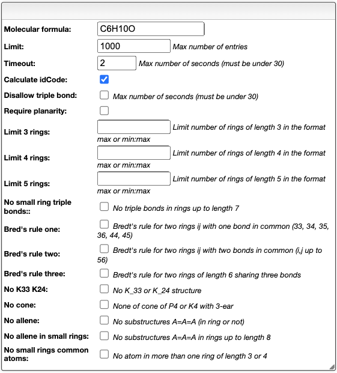

# Surge: Isomers generation

## Introduction

Surge is a tool to generate isomers from a molecular formula. It is based on the paper [Surge: a fast open-source chemical graph generator](https://doi.org/10.1186/s13321-022-00604-9).

## Isomers generation

This tool provides a list of options for the generation of isomers. The list of options is given in the panel shown below.

