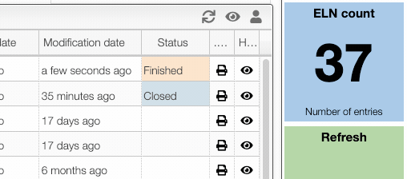
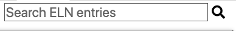
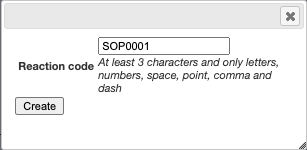
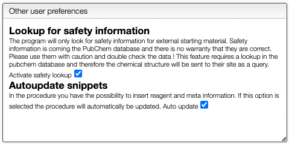
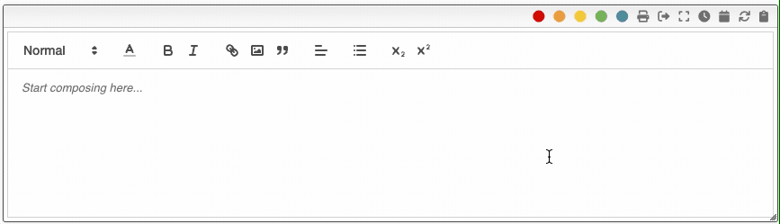
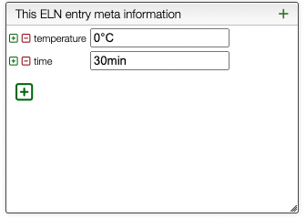
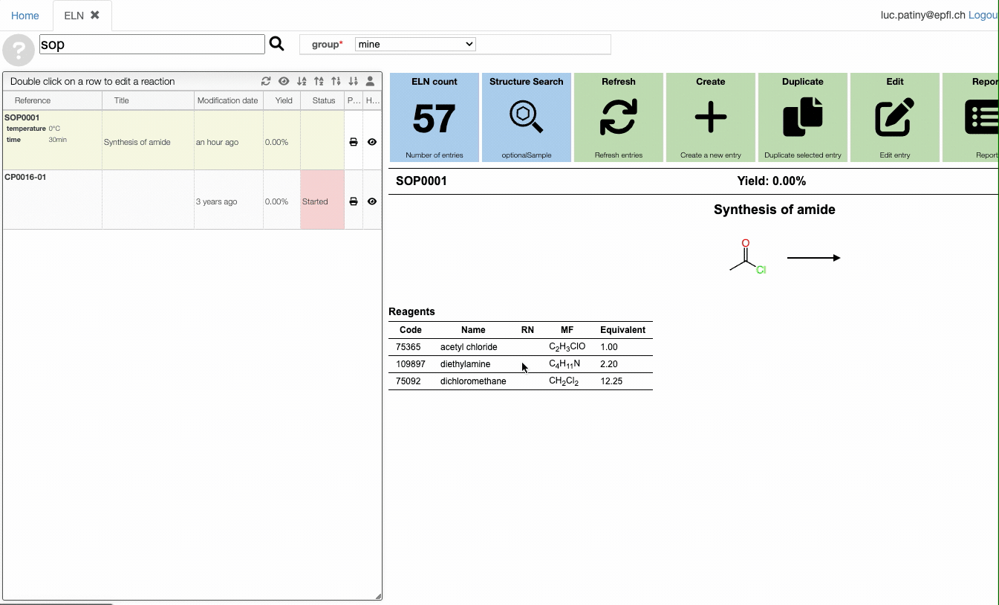

# TOC of ELN entries

This view allows to manage the reaction entries in the Electronic Laboratory Notebook.

From there you can:

- Search by reaction code or reaction description
- Add a new reaction
- Duplicate an existing reaction
- Hide / Show some reactions

## Show / Hide reactions

You may want to hide some reactions because they failed or didn't provide useful information.

To hide an entry click on the `eye` icon in the list of reactions.

You can also show all the hidden reactions by clicking on the `eye` in the window header. You have then the possibility to unhide reaction.

## Searching

Using the search box you can a keyword. This will search in:

- reaction code
- reagents code, name, mf, rn
- products batch, mf
- reaction description

You can also make advance queries by specifying a field like for example:

- `yield:>0`: yield greater than 0. You need to put `0.1` for 10%!
- `temperature:>20 temperature:<50`: temperature greater than 20 and smaller than 50.
- `temperature:=20`: by default the field shoud 'contain' the value so `200` would match as well. If a field should have the exact specified value you can use `=`
- `reference:LP12`: all the entries having in the reference `LP12`
- `title:test`: all the entries having in the title the word `test`

## Standard Operating Procedure

In many research fields we are following standard operating procedure. In order to create those procedures the simplest is to add normal 'eln' entries with codes like SOPxxxxx. Those entries can be shared in the group.

The ELN allows to define shortcuts and to update automatically the variable parameters. Automatic updaate is activated from the `Prefs` tab.

When creating SOP it is important to use the shortcuts and to define all variable parameters as `meta` information. This allows not only to easily change the parameters but also to check the variation from one reaction to another from the overview and to be able to generate reports.

### Creating reaction from SOP

Once SOPs have been defined, creating a new procedure consists of searching the SOP and duplicate it.

