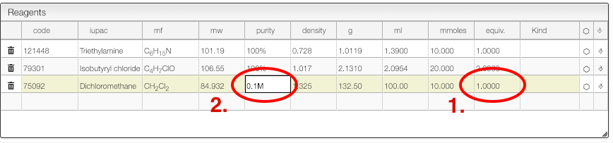
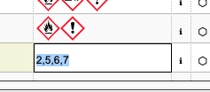

import TOCInline from '@theme/TOCInline'
import Reaction from './includes/reaction/README.md'
import InsertSnippets from './includes/insertSnippets/README.md'
import Preferences from './includes/preferences/README.md'
import Purity from './includes/purity/README.md'
import ProductInfo from './includes/productsInfo/README.md'
import Mixture from './includes/mixtureSolvents/README.md'
import Many from './includes/multipleTimes/README.md'
import Copy from './includes/copyProduct/README.md'

<TOCInline toc={toc} />

# Introduction

This view allows creating and edit an electronic laboratory notebook entry (reactions).

## User preferences

<Preferences/>

## Organic reaction

<Reaction/>

### Some tips for organic reactions

<Purity/>

<ProductInfo/>

<Mixture/>

<Many/>

<Copy/>

## Insert snippets, reagents and meta information

<InsertSnippets/>

## Miscellaneous

### Drag drop images

You may just copy / paste an image of the “Drop or paste” zone, and it will be inserted in the procedure.

### Calculate solvent volume to reach specific concentration

For some reaction it is important to calculate the solvent to reach a specific concentration.

The reagent table allows to do this:

1. For the solvent enter as number of equivalent '1'
2. Enter the concentration you want to achieve in the 'Purity' column.

### Safety information

When looking for commercial products you may decide to also lookup for safety information in [PubChem](https://pubchem.ncbi.nlm.nih.gov/).

To activate this feature, click on `prefs` and check `Activate safety lookup`. Don't forget to save your new preferences!

It is also possible to directly edit the safety information by clicking in the `Hazard pictogram` column and entering the various GHS pictogram code separated by a comma.

More information from PubChem about the chemical can also be found by clicking on the 'i' icon.
