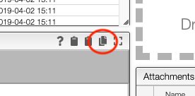
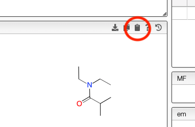

# Copy product as molfile

If a sample was created using method other than from the reaction the chemical structure, molecular formula and molecular weight will not be copied automatically. This is the case for example when a sample is analyzed by NMR and the sample is created automatically during importation.

There is a simple way to copy / paste the chemical structure of the product.

The product is copied as a molfile and can be paste in a sample entry.

It could be pasted for example in ChemDraw using `Edit -> Paste Special -> Mol text`
