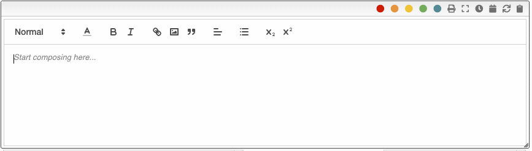

It is possible to define an unlimited number of snippets and to recall them directly in the procedure by typing its abbreviation (followed by `Tab`, `Space`, or `Enter`).

All the reagents can also be inserted by entering `r` followed by the reagent number. i.e. `r2`.

The ELN also allows to add an unlimited number of meta information key-value pairs. Those meta information can not only be inserted in the procedure but also in snippets. In order to include the meta information you should type `_` followed by the name of the property. For example `_temperature`. The use of meta information allows to centralize all the parameters that change from one reaction to another. This is especially useful in the case of parallel synthesis.

It is also possible to define default meta information, that can be reused in any new or old reaction. To retrieve the default meta information, just click on the  button. 
You can add at any time labels to the list of default meta information in the following panel.

### Insertion of predefined sentences

In order to insert predefined sentences you can click on the `clipboard` icon.
A dialog containing the list of predefined sentences will appear, and you should
click on the one you want.

