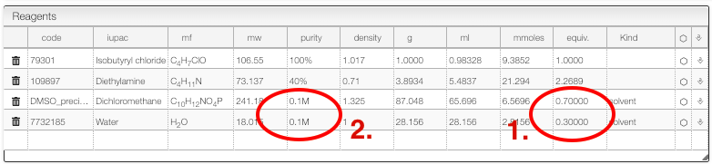

:::tip Mixture of solvents

    

    There is an easy to deal with mixture of solvents.
    

    

## Calculate mixture of solvents volume to reach specific concentration

For some reactions it is important to calculate the solvent to reach a specific concentration and in some cases it can be a mixture of solvents.

The reagent table allows dealing with mixture of solvent. In this case we would like to work in DMSO/H2O in a ratio (70/30):

1. For the solvents enter the number of equivalent so that the sum is `1`
2. Enter the concentration you want to achieve in the 'Purity' column of all the solvents.

:::