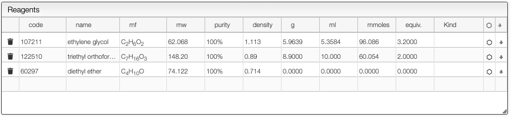

:::tip Many times the same reagent

    

    In some cases it is required to add many times the same reagent.
    

    

## Same reagent multiple times

In some reactions such as in the example below, the product is formed via the combination of multiple reagent molecules.

In this example the mixture of ethylene glycol with triethyl orthoformate yields a cyclic orthoester. In order to enter the quantities for this kind of reaction you need to specify correctly the number of equivalents of the reagent that limits the yield. In this case the triethyl orthoformate limits the yield, so we enter two equivalents for this reagent.

This will allow calculating correctly the expected quantity of the product as well

:::