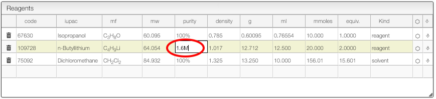

:::tip Purity

    

    You can specify the purity of a reagent.
    

    

### Specifying the purity of a reagent

The purity of a reagent may be specified using 3 possibles units:

- `%`: purity as mass ratio
  - like 40% HNMe2 in water
- `M` (or `mM`): moles/liter (or mmoles/liter)
  - like 1.6M BuLi
- `L`: loading: mole/kg
  - useful for solid phase synthesis
- `?`: unknown purity
  - when working with natural products like wood or in material science the sample does not have a molecular formula and therefore it is not possible de define the number of mmoles. Using `?` as units allows to freely define weight, density and volume.

:::
