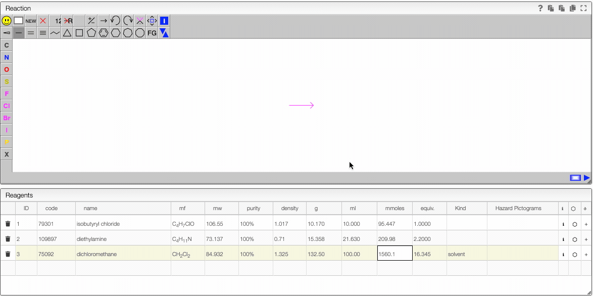

When preparing a new organic reaction the idea is first to add the different reagents and then to fill the schema with simple clicks. The concept behind it is that either the product is commercially or it was synthesized before. Therefore, all the chemical structures of the reagents are already known.

### Lookup for a product

You should use the column `code` in order to lookup for a product.

In this column you may either enter:

- CAS number
- product name
- molecular formula
- **product code** (practical to retrieve a product you synthesized before)

A molecular formula may be entered the way a chemist think about it. Meaning you are allowed to use groups and parenthesis like `Me2CHCOCl`.

Once the string entered press `tab` in order to trigger the lookup. The system will search in a reference database of 400000 molecules and also for all the internal products you have access to.

Click on the right product to copy the name, structure and density.

### Defining the quantities

The reagent calculator is connected to databases and can retrieve information about a chemical. For instance in the "code" you may enter a molecular formula, name or CAS number and the system will look for commercially available chemicals. You can then select the molecule you want to add in the table.

- If you enter a new sample and change the molecular formula, molecular weight will be automatically calculated. In the molecular formula you may enter groups like Et, Ph, Ts, ... as well as parentheses.
- The purity may be entered in `%`, `M` (molar), `mM` (millimolar) or `L` (loading). Molar is expressed in mmoles / mL and loading is expressed by mmoles / g and is practical for solid phase synthesis.
- The first reagent for which you add a quantity will be defined as 1 equivalent. You may still change this anytime. After defining the first quantity you will probably want to define the other reagents from the equivalent columns rather than the quantity (except probably for the solvent).
- One the equivalents are specified those samples are “connected”. This means that if you change the quantity of one of the reagents all the quantity will change.
- It is possible to remove the link between the reagents by unselecting the “Link” checkbox.

### Drawing the schema

JSME is a simple-to-use and powerful tool developed by Peter Ertl and Bruno Bienfait. In order to draw the reaction we will start by adding the chemical structures from the reagent table.

It is possible to select a molecule by going hover it. Once selected you can move this molecule \(just click around and drag the mouse\).

:::info Molecule selection
Even if the molecule does not appear as being selected you can still act on it. In instance, you can:

- copy to the molecule to the other side of the reaction by clicking on the arrow.
- click on the white rectangle to delete this selected molecule.

:::

### Check analysis

A reaction contains various sample. Sample can be either isolated and purified products or just any analysis related to the reaction.

A sample contains all the analysis related to it (NMR, GC, IR, Mass, etc) and each of the analysis have a specific view to process them.

It is now possible to jump directly to the corresponding analysis view by clicking on the corresponding color bullet from the sample list.

To create a new sample, you simply need to click on the button `Add empty sample` and choose a batch name, this will create a new batch where you can include any type of spectra and additional information. Once you refresh the page in the global reaction, you will see the new batch in the list. If you click on the batch, there will be a preview of the information you have entered.
