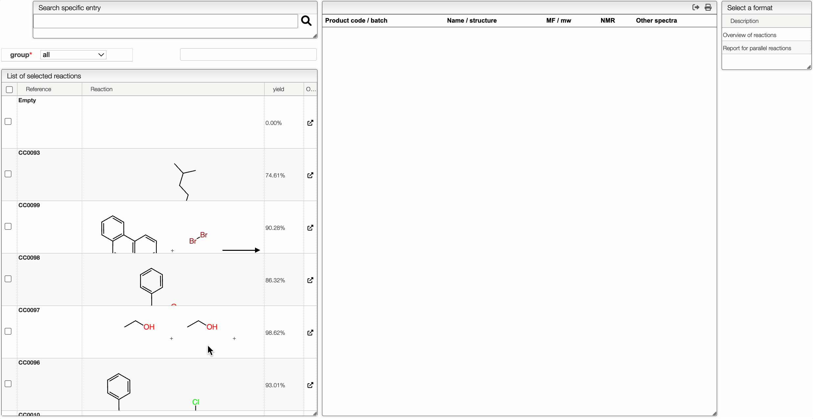

# Multi Reaction Report

## Create a report

The Multi Reaction Report is an easy way to see multiple reactions in a single view. You can search for a specific reaction by the reaction reference or the yield. You can also see the full list of reaction on the left table. Once you have selected reactions you want to make a report for, you can click on one of the reaction report method which are either `Overview of reactions` or `Report parallel reactions`.

The `Overview of reactions` method is used to have a visual representation of the reactions. The `Report parallel reactions` method is used to have a global understanding of the influence of the reaction conditions to the yield in the case of parallel reactions.

## Exporting the report

It is possible to export the report by clicking on the corresponding report. The table will then be copied in the clipboard, and you can paste it in a spreadsheet for example.
