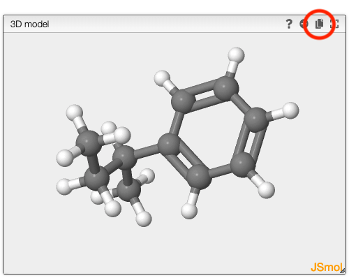
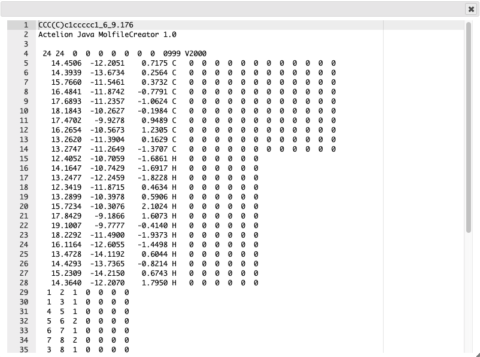

# Generate 3D conformations

Draw a molecule and generate conformations.

This tool is using [Moloc](http://www.moloc.ch)/

You can also measure distance in the model by double-clicking on the first atom and moving the mouse to another atom and double-click on it.

You may also paste a molfile or a SMILES by moving your pointer over the structure editor and press `CTRL` + `V`

## Copy model as molfile

If you would like to copy the resulting model you can generate a molfile by clicking on the copy icon in the model window.

A window will open that contains the molfile.

