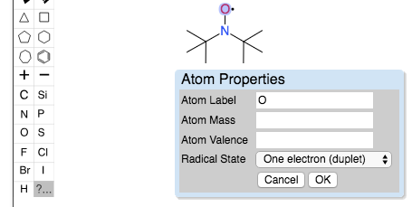
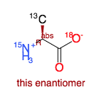

## Edition of atom properties (radical, isotopes, etc)

In openchemlib editor it is possible to specify radicals. Select the  button and click on the atom you want to modify. You can then enter specific mass (isotopes), atom valence or radical state.

