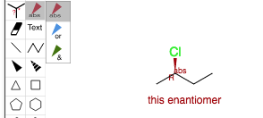
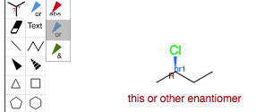
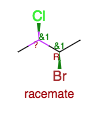
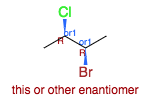
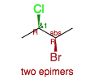
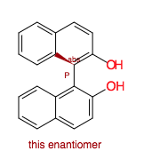

## Stereochemistry and openchemlib editor

Stereochemistry in organic chemistry is a complex problem. You may have axial chirality, racemic compounds, mixture of diastereoisomers, etc.

The openchemlib editor supports the enhanced stereo recognition (ESR) introduced by Molecular Design Ltd. with IsisDraw V2.5. The ESR Tools allow defining for every stereo center, whether it is an absolute one or if it belongs to a group of stereo centers that have the drawn, but relative configuration. For any group of relative stereo centers one may define that the drawn and the inverse configurations are present, i.e. that we have a racemic situation concerning the group members. This is indicated by green stereo bonds and an ampersand '&' at the stereo centers. Likewise, one may define groups of relative stereo centers that contain either the drawn configuration or the opposite one. Stereo centers of such a group are indicated by blue stereo bonds and the word 'or' at the stereo centers. In addition to the '&' or 'or' indicators group numbers show which stereo centers belong to the same group.

### One chiral center: 2-chlorotobutane

Openchemlib editor will enforce chirality. If there is too much or not enough information about stereochemistry it will be represented by pink bonds.

Even with this simple molecule we have 3 possibilities:
* there is only one enantiomer and we know which one
* we have a mixture of both enantiomers (&)
* there is only one enantiomer, but we don't know which one (or)

To differentiate between those 3 possibilities, 3 enhanced stereo recognition bonds are available

As an alternative you can also specify that the configuration of the chiral center is unknown using

### Two chiral centers: 2,3-bromochlorobutane

Each chiral center can be addressed separately and many possibilites exist. Couple of examples:

* *2 chiral centers but the relation between the 2 centers is fixed and you obtain a pair of enantiomers (racemate):

* only one enantiomer with known relationship between the 2 chiral centers:

* absolute configuration of one of the chiral center and one of the 2 possible diastereoisomers:

* absolute configuration of one of the chiral center and both possible diastereoisomers:

### Axial chirality

Openchemlib editor is able to deal with axial chirality like in the case of allenic or binap systems.

