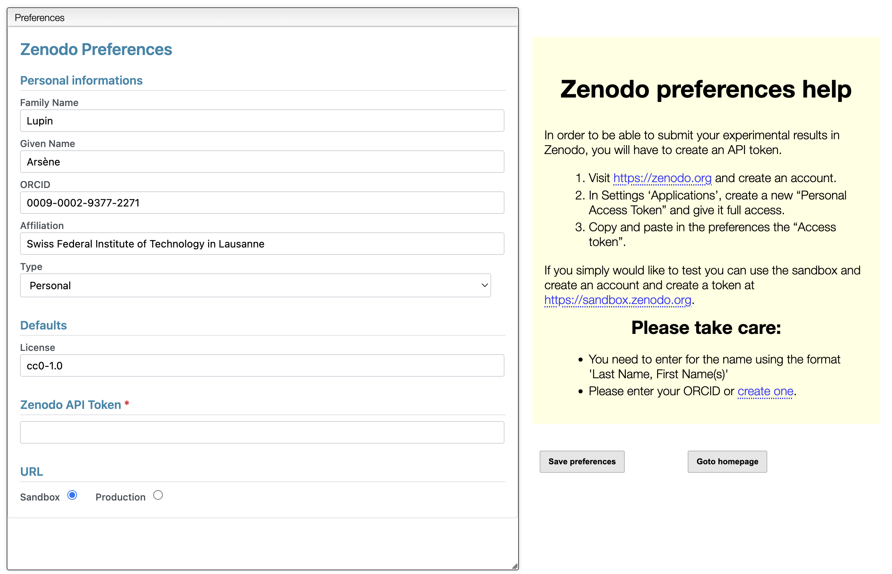
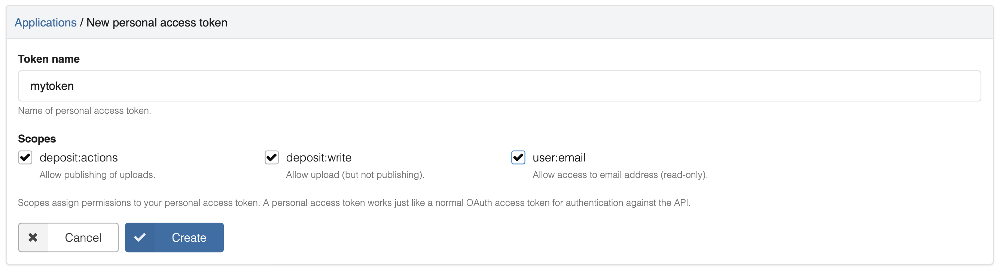
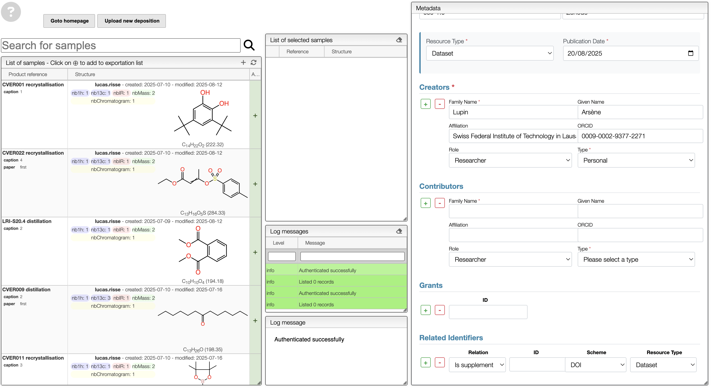
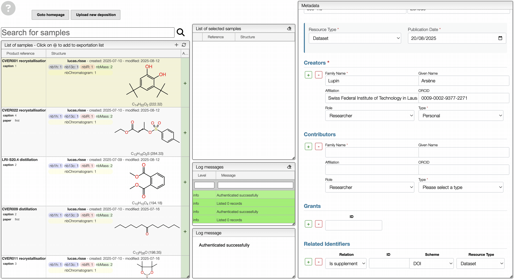
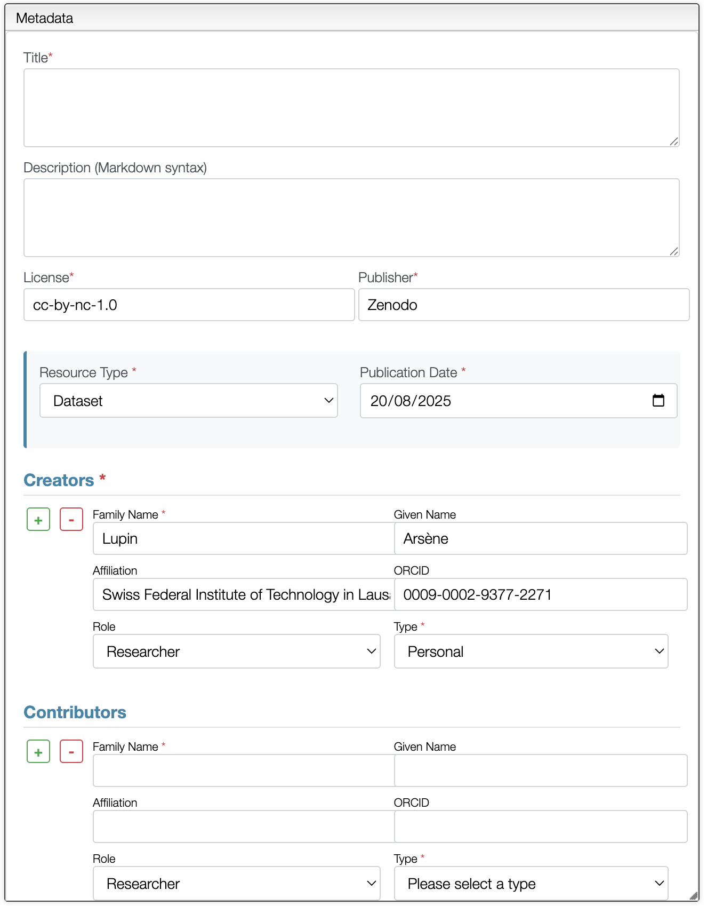
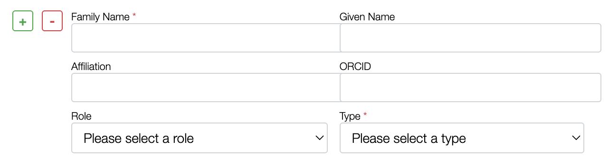
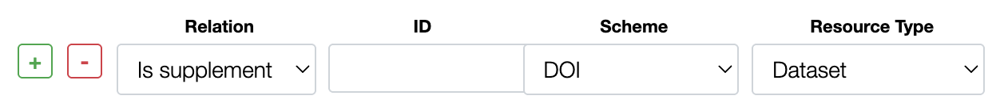

# Submit data to Zenodo

[Zenodo](https://zenodo.org/) is an open-access research data repository developed under the European OpenAIRE program and operated by CERN. It allows researchers to **share, preserve, cite, and access** research outputs (datasets, publications, software, and more). Zenodo provides free DOI (Digital Object Identifier) generation for uploads, making your research products easily citable and accessible.

## First login

When you first enter the Zenodo tool, you will need to log in with your Zenodo account or create a new account if you don't have one. The login process is done with the **Zenodo API token**.

Include your Family Name, First name, ORCID (if you have no ORCID iD, you can create one for free at [orcid.org](https://orcid.org/)), affiliation (auto-completion), type of account (Personal or Organization), license, API Token and enable **sandbox** or **production** mode.

:::important
There are two types of Zenodo accounts:
1. [**Zenodo Sandbox accounts**](https://sandbox.zenodo.org/): For testing and development purposes without affecting live data.
2. [**Zenodo**](https://zenodo.org/): For production use, where your research outputs are publicly accessible.
:::

> ### How to get the token?
> 1. Log in to your Zenodo account.
> 2. Navigate to your profile in the top right corner.
> 3. Click on "Applications".
> 4. On "Personal access tokens", click on "new token".
> 5. Name your token, select all the rights, and click "Create".
> 
> 6. Copy the generated token and paste it into the Zenodo tool in the "API Token" field.
> - ⚠️ Do not share your API token with anyone.
> - ⚠️ Copy and save your API token in a secure place, as it will not be shown again.

Then, click on `Save preferences` to apply your changes. This can be changed anytime later in the settings.

## Create a new deposition

To create a new deposition, on the homepage go to `Create new deposition`. You arrive on the following page:

### Select samples

After opening a new deposition, you need to select the samples you want to upload. You can easily filter your samples using the search bar or by navigating through the folder structure.

:::tip
Add metadata to your samples to easily find them. For example having a field containing the label of a molecule for a publication can be very helpful.
:::

Then, select all your compounds using `Shift + Click` or `Ctrl + Click` and click on `+`. It will add all the spectra linked with the selected compounds.

### Fill in deposition metadata

Once you have selected your compounds and created a new deposition, you must complete the metadata form. This step is essential to ensure your dataset is properly described, searchable, and citable.

The form contains the following fields:

| Field              | Description                                                                                  | Example                                  |
|--------------------|----------------------------------------------------------------------------------------------|------------------------------------------|
| **Title**          | A concise, descriptive title for your dataset or record.                                     | *Dataset for the study of Diels-Alder reactions*                   |
| **Description**    | A detailed description using Markdown syntax (supports formatting, links, lists, etc.).      | *This dataset contains chemical spectra…* |
| **License**        | Choose an appropriate license for your data. Zenodo supports Creative Commons and others.    | *CC-BY-NC-1.0*                           |
| **Publisher**      | Defaults to **Zenodo**.                                                                      | *Zenodo*                                 |
| **Resource Type**  | Select the type of record (e.g., Dataset, Publication, Software, Image).                     | *Dataset*                                |
| **Publication Date** | Date the dataset is made publicly available.                                               | *20/08/2025*                             |

### Creators

In this section, you must list the main creators of the dataset. Each creator entry requires:

- **Family Name** and **Given Name**
- **Affiliation** (auto-complete available)
- **ORCID iD** (optional but recommended for persistent identification)
- **Role** (e.g., Researcher, Author)
- **Type** (Personal or Organizational account)

:::tip
Always include ORCID iDs for authors whenever possible, this helps with correct attribution and integration in academic systems.
:::

### Contributors

You may also add contributors who were involved but are not primary creators. For each contributor, fill in:

- **Family Name** and **Given Name**
- **Affiliation** and **ORCID iD**
- **Role** (e.g., Data Curator, Editor, Project Manager)
- **Type** (Personal or Organization)

This helps acknowledge everyone involved in producing the dataset.

### Related identifiers

This field allows you to link your data to other relevant identifiers. It helps establish connections between related works and improves discoverability. `Is supplement to` can be used for linking the DOI of the publication.

:::important
All required fields (marked with *) must be completed before you can publish your deposition.
:::

### Upload deposition

Once you have filled in all required fields and are satisfied with your deposition, you can upload it by clicking the **Upload new deposition** button. This will push the deposition to Zenodo for processing and publication.
